# KDev 执行阶段流程设计 v3.0.3

> 本文档是 v3.0.2 的执行阶段流程修订，覆盖需求阶段、编码阶段、测试阶段的完整流程重构。
>
> 未列入本修订的 v3.0.2 其他章节（核心理念、六层架构、记忆系统等）继续有效。

---
createdAt: '2026-04-29'
status: draft
owner: ly
---

## 一、修订概要

### 1.1 修订范围

| 维度 | v3.0.2 | v3.0.3 修订 |
|-----|--------|------------|
| 阶段划分 | Phase 1 规划 + Phase 2 执行循环 | **三阶段结构**：需求阶段 → 编码阶段 → 测试阶段 |
| 节点命名 | 编号缩写式（P1-IR、E4-DEV） | **自然语言式**（头脑风暴、原型设计、编写计划） |
| Skill集成 | 承重墙/补缺分类 + 原子能力库概念 | **统一原子能力库模式**：所有外部skill作为原子能力，智能体按需调用 |
| Gate机制 | HARD-GATE只在Phase切换 + 节点级gate扩展 | **阶段内多Gate**：每个阶段内多个评审gate，gstack评审 + 人工裁决 |
| 迭代模式 | 固定循环（NEXT-ITERATION） | **按项目类型选择**：单迭代/多迭代循环 |

### 1.2 核心设计决策（来自头脑风暴澄清）

| 序号 | 决策项 | 选择 | 理由 |
|-----|-------|-----|-----|
| 1 | 技术方案产出形态 | 一页式简短文档 | 对齐技术栈和大致需求，快速澄清 |
| 2 | 原型评审循环机制 | 人工裁决循环 | gstack评审 → 发现清单 → 人决定修订哪些 |
| 3 | 测试用例评审 | 必经gate | AI输出可能覆盖不完整，必须人工确认 |
| 4 | 执行阶段技能编排 | 智能体自主编排 | 根据任务复杂度选择Path A/B |
| 5 | 代码扫描策略 | 阶段累积式 | 小迭代review → Epic +lint → 发布+SAST |
| 6 | 验收机制 | 系统测试后独立gate | 测试通过 → 人进行最终验收 |
| 7 | 迭代模式 | 按项目类型选择 | 小项目单迭代，大项目多迭代 |
| 8 | gstack评审角色 | 按阶段选择角色 | 需求plan-eng-review、原型design-review、测试qa |
| 9 | Skill集成方式 | 统一原子能力库 | superpowers/bmad/speckit/gstack都作为原子能力库 |
| 10 | 需求阶段产出物命名 | 评审通过后重命名 | SPEC.md → 需求文档.md |
| 11 | 需求阶段最终产出 | 三项输出 | 需求文档.md + 原型.html + 方案设计.md |
| 12 | 测试阶段输入 | 全量制品 | 需求+编码阶段所有制品 |

---

## 二、三阶段总览

### 2.1 阶段定位

| 阶段 | 核心目的 | 主要产出 | 关键Gate |
|-----|---------|---------|---------|
| **需求阶段** | 需求澄清 + 原型对齐 | 需求文档.md + 原型.html + 方案设计.md | 需求评审、SPEC评审、原型评审、方案评审 |
| **编码阶段** | 实施计划 + 开发交付 | 实施计划.md + 测试用例 + 代码产物 | 测试用例评审、完成前验证 |
| **测试阶段** | 系统测试 + 验收 | 测试报告 + 验收确认 | 验收gate（人工） |

### 2.2 Skill集成原则

所有外部skill作为**原子能力库**引入，智能体按需调用：

| 来源 | 原子能力示例 |
|-----|------------|
| superpowers | brainstorming、writing-plans、test-driven-development、verification-before-completion |
| speckit | speckit-specify、speckit-plan |
| frontend-design | 原型设计产出HTML |
| gstack | plan-eng-review、design-review、qa |
| playwright | playwright-skill |

---

## 三、需求阶段详细设计

### 3.1 流程图

```
输入：原始需求/IR
         ↓
[brainstorm] ─────────────────────────────────── superpowers:brainstorming
         ↓
◆ 需求评审 ──────────────────────────────────── plan-eng-review + 人工gate
         ↓
[speckit-specify] ────────────────────────────── speckit (原子能力)
         ↓                                       输出：SPEC.md
◆ SPEC评审 ──────────────────────────────────── plan-eng-review + 人工gate
         ↓
[Frontend Design] ────────────────────────────── frontend-design (原子能力)
         ↓                                       输出：原型.html
◆ 原型评审 ──────────────────────────────────── design-review + 人工gate
         ↓
┌─────────────────────────────┐
│   反馈迭代优化区域           │
│   [原型.html] ↔ [SPEC.md]   │ ─── 双向反馈迭代
└─────────────────────────────┘
         ↓
[speckit-plan] ───────────────────────────────── speckit (原子能力)
         ↓                                       输出：方案设计.md
◆ 方案评审 ──────────────────────────────────── plan-eng-review + 人工gate
         ↓
◆ 评审通过确认 ────────────────────────────────── 人工gate（最终确认）
         ↓                                       SPEC.md → 重命名为需求文档.md
输出：需求文档.md + 原型.html + 方案设计.md
```

### 3.2 节点清单

| 节点名称 | 类型 | Skill来源 | 产出 | Gate类型 |
|---------|-----|----------|-----|---------|
| brainstorm | 执行 | superpowers:brainstorming | 澄清后需求 | 需求评审gate |
| speckit-specify | 执行 | speckit（原子能力） | SPEC.md | SPEC评审gate |
| Frontend Design | 执行 | frontend-design（原子能力） | 原型.html | 原型评审gate |
| 反馈迭代优化 | 循环 | - | 原型+SPEC同步优化 | - |
| speckit-plan | 执行 | speckit（原子能力） | 方案设计.md | 方案评审gate |
| 评审通过确认 | gate | 人工 | 需求文档.md（重命名） | 最终确认 |

### 3.3 Gate机制

每个gate采用**gstack评审 + 人工裁决**模式：

1. gstack评审产出发现清单
2. 用户决定"采纳哪些/修订哪些/跳过哪些"
3. 不通过则返回上游节点修订
4. 通过则继续下一节点

---

## 四、编码阶段详细设计

### 4.1 流程图

```
输入：需求文档.md + 原型.html + 方案设计.md
         ↓
[writing-plans] ──────────────────────────────── superpowers:writing-plans
         ↓                                       输出：实施计划.md + 测试用例
◆ 测试用例评审 ───────────────────────────────── qa + 人工gate
         ↓                                       确保覆盖完整性
[git worktree] ───────────────────────────────── superpowers:using-git-worktrees
         ↓                                       创建隔离开发环境
┌─────────────────────────────────────┐
│       执行开发（智能体自主编排）      │
│                                     │
│  Path A（复杂任务）                  │
│  └─ subagent-driven-development     │
│                                     │
│  Path B（简单任务）                  │
│  └─ executing-plans                 │
│                                     │
│  ↓                                  │
│  [TDD循环]                          │
│  └─ test-driven-development         │
│    Red → Green → Refactor           │
│                                     │
│  ↓                                  │
│  [两轮评审]                          │
│  └ requesting-code-review           │
│  + receiving-code-review            │
│  规格 + 质量                         │
│                                     │
└─────────────────────────────────────┘
         ↓
[verification-before-completion] ─────────────── superpowers:verification-before-completion
         ↓                                       tests must pass
[代码扫描] ────────────────────────────────────── 累积式扫描
         ↓                                       小迭代：review + lint
                                                Epic：+静态分析
                                                发布：+SAST/fortify
[finishing-a-development-branch] ─────────────── superpowers:finishing-a-development-branch
         ↓                                       合并/PR/清理选项
输出：实施计划.md + 测试用例 + 代码产物
```

### 4.2 节点清单

| 节点名称 | 类型 | Skill来源 | 产出 | Gate |
|---------|-----|----------|-----|------|
| writing-plans | 执行 | superpowers:writing-plans | 实施计划.md + 测试用例 | 测试用例评审gate |
| git worktree | 执行 | superpowers:using-git-worktrees | 隔离开发分支 | - |
| 执行开发 | 编排 | 智能体自主选择Path | 代码实现 | - |
| TDD循环 | 执行 | superpowers:test-driven-development | 通过的单元测试 | - |
| 两轮评审 | 执行 | superpowers:requesting/receiving-code-review | 评审结论 | - |
| verification-before-completion | 验证 | superpowers:verification-before-completion | 验证证据 | - |
| 代码扫描 | 执行 | 累积式调用 | 扫描报告 | - |
| finishing-a-development-branch | 执行 | superpowers:finishing-a-development-branch | 合并/PR | - |

### 4.3 执行开发路径选择

智能体根据任务复杂度自主选择执行路径：

| 路径 | 适用场景 | 核心skill | 特点 |
|-----|---------|----------|-----|
| **Path A** | 复杂任务、多模块、需要并行审查 | subagent-driven-development | 分发子代理 + 两轮审查（规格+质量） |
| **Path B** | 简单任务、单模块、快速迭代 | executing-plans | 直接执行计划 + 基础代码审查 |

### 4.4 代码扫描累积策略

| 阶段 | 扫描内容 | 触发时机 |
|-----|---------|---------|
| 小迭代 | code-review + lint | 每个功能单元完成 |
| Epic完成 | +静态分析 | 每个Epic里程碑 |
| 发布前 | +SAST/fortify | 版本发布前 |

---

## 五、测试阶段详细设计

### 5.1 流程图

```
输入：需求文档.md + 原型.html + 方案设计.md
      + 实施计划.md + 测试用例 + 代码产物
         ↓
[playwright-skill] ───────────────────────────── playwright-skill (原子能力)
         ↓                                       输出：测试报告
[测试结果评审] ───────────────────────────────── qa
         ↓                                       覆盖率分析、失败项清单
◆ 验收 ────────────────────────────────────────── 人工gate（必经）
         │                                       功能演示 + 需求核对
    ┌────┴────┐
    ↓         ↓
 [通过]    [不通过]
    ↓         ↓
 [迭代完成] [返工循环]
    ↓         │
 输出：      │
 验收报告    │
 +可交付制品 │
             │
             ↓
      返回编码阶段修订
```

### 5.2 节点清单

| 节点名称 | 类型 | Skill来源 | 产出 | Gate |
|---------|-----|----------|-----|------|
| playwright-skill | 执行 | playwright-skill（原子能力） | 测试报告 | - |
| 测试结果评审 | 评审 | qa（原子能力） | 覆盖率分析 | - |
| 验收 | gate | 人工 | 验收确认/返工决策 | 人工gate（必经） |
| 迭代完成 | 终点 | - | 验收报告 + 可交付制品 | - |
| 返工循环 | 循环 | - | 返回编码阶段修订 | - |

### 5.3 验收内容

验收gate检查项：

1. 功能演示符合原型
2. 需求覆盖完整性核对
3. 测试用例执行结果确认
4. 代码扫描结果确认

### 5.4 迭代决策

验收通过后的路径选择：

| 项目类型 | 后续动作 |
|---------|---------|
| 单迭代项目 | 项目完成，交付 |
| 多迭代项目 | 进入下一迭代，返回需求阶段 |

---

## 六、三阶段完整流程图

### 6.1 完整流程图（Mermaid版）

```mermaid
%%{init: {'flowchart': {'nodeSpacing': 30, 'rankSpacing': 50}}}%%
flowchart LR
    %% ===== 需求阶段 =====
    subgraph 需求阶段
        direction LR
        A1((开始)) 
        --> A2[头脑风暴<br/>━━━━━━━━━━━<br/>superpowers:brainstorming<br/>澄清需求边界]
        --> A3{需求评审<br/>━━━━━━━━━━━<br/>gstack:plan-eng-review<br/>人工裁决}
        --> A4[规格细化<br/>━━━━━━━━━━━<br/>speckit:specify<br/>输出SPEC.md]
        --> A5{SPEC评审<br/>━━━━━━━━━━━<br/>gstack:plan-eng-review<br/>人工裁决}
        --> A6[原型设计<br/>━━━━━━━━━━━<br/>frontend-design<br/>输出原型.html]
        --> A7{原型评审<br/>━━━━━━━━━━━<br/>gstack:design-review<br/>反馈迭代}
        --> A8[方案设计<br/>━━━━━━━━━━━<br/>speckit:plan<br/>输出方案.md]
        --> A9{方案评审<br/>━━━━━━━━━━━<br/>gstack:plan-eng-review<br/>人工裁决}
        --> A10{通过确认<br/>━━━━━━━━━━━<br/>人工最终确认}
        --> A11((需求产出))
    end
    
    %% Gate返回循环（需求阶段）
    A3 -.->|不通过| A2
    A5 -.->|不通过| A4
    A7 -.->|不通过| A6
    A9 -.->|不通过| A8

    %% ===== 编码阶段 =====
    subgraph 编码阶段
        direction LR
        B1((需求输入))
        --> B2[编写计划<br/>━━━━━━━━━━━<br/>superpowers:writing-plans<br/>实施计划+测试用例]
        --> B3{测试用例评审<br/>━━━━━━━━━━━<br/>gstack:qa<br/>覆盖完整性gate}
        --> B4[隔离环境<br/>━━━━━━━━━━━<br/>superpowers:git-worktree<br/>创建开发分支]
        --> B5[执行开发<br/>━━━━━━━━━━━<br/>智能体编排<br/>Path A/B选择]
        --> B6[TDD循环<br/>━━━━━━━━━━━<br/>superpowers:tdd<br/>Red→Green→Refactor]
        --> B7[两轮评审<br/>━━━━━━━━━━━<br/>superpowers:code-review<br/>规格+质量]
        --> B8[完成验证<br/>━━━━━━━━━━━<br/>superpowers:verification<br/>tests must pass]
        --> B9[代码扫描<br/>━━━━━━━━━━━<br/>累积式<br/>review→lint→SAST]
        --> B10[完成分支<br/>━━━━━━━━━━━<br/>superpowers:finishing<br/>合并/PR]
        --> B11((编码产出))
    end
    
    %% Gate返回循环（编码阶段）
    B3 -.->|不通过| B2

    %% ===== 测试阶段 =====
    subgraph 测试阶段
        direction LR
        C1((全量输入))
        --> C2[系统测试<br/>━━━━━━━━━━━<br/>playwright-skill<br/>E2E自动化]
        --> C3[测试评审<br/>━━━━━━━━━━━<br/>gstack:qa<br/>覆盖率分析]
        --> C4{验收<br/>━━━━━━━━━━━<br/>人工gate<br/>功能演示+核对}
        --> C5[通过]
        --> C6((迭代完成))
        
        C4 --> C7[不通过]
        C7 -.->|返工| B5
    end
    
    %% 多迭代循环
    C6 -.->|多迭代项目| A1

    %% ===== 阶段连接 =====
    A11 --> B1
    B11 --> C1
    
    %% ===== 样式 =====
    classDef exec fill:#1e88e5,color:#fff,stroke:#333,stroke-width:2px
    classDef gate fill:#f9a825,color:#fff,stroke:#333,stroke-width:2px
    classDef terminal fill:#43a047,color:#fff,stroke:#333,stroke-width:2px
    classDef passfail fill:#e8f5e9,color:#2e7d32,stroke:#333
    
    class A2,A4,A6,A8,B2,B4,B5,B6,B7,B8,B9,B10,C2,C3 exec
    class A3,A5,A7,A9,A10,B3,C4 gate
    class A1,A11,B1,B11,C1,C6 terminal
    class C5,C7 passfail
```



> **注意**：Mermaid渲染效果因平台而异。若上述图在您的环境中仍为竖向排列，建议：
> 1. 使用 Excalidraw 手动绘制（见下文绘制要点）
> 2. 或将此图导入支持 Mermaid 的工具（如 VS Code Mermaid 插件、Typora、Notion）

### 6.2 Excalidraw 绘制要点

**阶段划分**：三个大虚线框
- 需求阶段（上方）
- 编码阶段（中间）
- 测试阶段（下方）

**节点形状**：
- 执行节点：椭圆（蓝色填充 `#1e88e5`）
- Gate节点：菱形（黄色填充 `#f9a825`）
- 产出节点：矩形（绿色填充 `#43a047`）

**关键Gate**（必经人工评审）：
- 需求评审、SPEC评审、原型评审、方案评审
- 测试用例评审
- 验收

**循环箭头**：
- 原型 ↔ SPEC（反馈迭代优化）
- Gate不通过 → 返回上游节点修订
- 验收不通过 → 返回编码阶段

**Skill标注**：每个执行节点旁边标注原子能力来源

### 6.2 Excalidraw 绘制提示词

```
绘制 KDev 执行阶段三阶段流程图：

阶段划分（三个大虚线框）：
1. 需求阶段（上方）
2. 编码阶段（中间）
3. 测试阶段（下方）

节点形状：
- 执行节点：椭圆（蓝色填充）
- Gate节点：菱形（黄色填充）
- 产出节点：矩形（绿色填充）

关键Gate（必经人工评审）：
- 需求评审、SPEC评审、原型评审、方案评审（需求阶段）
- 测试用例评审（编码阶段）
- 验收（测试阶段）

循环箭头：
- 原型 ↔ SPEC（反馈迭代优化）
- Gate不通过 → 返回上游节点修订
- 验收不通过 → 返回编码阶段

Skill标注：
- 每个执行节点旁边标注原子能力来源
- 如：brainstorm → superpowers:brainstorming

阶段间箭头：
- 需求阶段输出 → 编码阶段输入
- 编码阶段输出 → 测试阶段输入
```

---

## 七、原子能力库清单

### 7.1 需求阶段原子能力

| 原子能力ID | 来源skill | 用途 | 产出 |
|-----------|----------|-----|-----|
| brainstorming | superpowers:brainstorming | 需求澄清、头脑风暴 | 澄清后需求 |
| speckit-specify | speckit | 规格细化 | SPEC.md |
| frontend-design | frontend-design | 原型设计 | 原型.html |
| speckit-plan | speckit | 方案设计 | 方案设计.md |
| plan-eng-review | gstack | 需求/SPEC/方案评审 | 评审发现清单 |
| design-review | gstack | 原型评审 | 评审发现清单 |

### 7.2 编码阶段原子能力

| 原子能力ID | 来源skill | 用途 | 产出 |
|-----------|----------|-----|-----|
| writing-plans | superpowers:writing-plans | 编写实施计划 | 实施计划.md + 测试用例 |
| using-git-worktrees | superpowers:using-git-worktrees | 创建隔离环境 | 隔离开发分支 |
| subagent-driven-development | superpowers:subagent-driven-development | 复杂任务执行 | 代码实现 |
| executing-plans | superpowers:executing-plans | 简单任务执行 | 代码实现 |
| test-driven-development | superpowers:test-driven-development | TDD循环 | 单元测试 |
| requesting-code-review | superpowers:requesting-code-review | 请求代码评审 | 评审请求 |
| receiving-code-review | superpowers:receiving-code-review | 接收评审反馈 | 修复行动 |
| verification-before-completion | superpowers:verification-before-completion | 完成前验证 | 验证证据 |
| finishing-a-development-branch | superpowers:finishing-a-development-branch | 完成分支 | 合并/PR |
| qa | gstack | 测试用例评审 | 评审发现清单 |

### 7.3 测试阶段原子能力

| 原子能力ID | 来源skill | 用途 | 产出 |
|-----------|----------|-----|-----|
| playwright-skill | playwright | 系统测试 | 测试报告 |
| qa | gstack | 测试结果评审 | 覆盖率分析 |

---

## 八、与 v3.0.2 的衔接

### 8.1 保持有效的内容

- 核心理念：Compound Engineering、AI主导执行/人主导规则
- 六层架构分层结构
- 记忆系统（五层记忆）
- 状态管理框架（六类状态）
- R-NNN 规则（R-001 ~ R-007）

### 8.2 被本修订替代的内容

| v3.0.2 章节 | v3.0.3 替代 |
|------------|------------|
| §四 14命令体系 | 三阶段节点体系（自然语言命名） |
| §四 状态机（P1-IR → E4-DEV） | 三阶段流程（需求→编码→测试） |
| §五 承重墙/补缺分类 | 统一原子能力库模式 |
| §二 HARD-GATE | 阶段内多Gate机制 |

---

## 附录 A：设计决策证据链

| 决策序号 | 来源 | 澄清过程 |
|---------|-----|---------|
| D1-D12 | 头脑风暴澄清 | 2026-04-29 交互式问答确认 |

## 附录 B：需求阶段流程图原始数据

见 `references/需求流程图.jpg` 及 Excalidraw JSON 数据（已在设计过程中解析）。