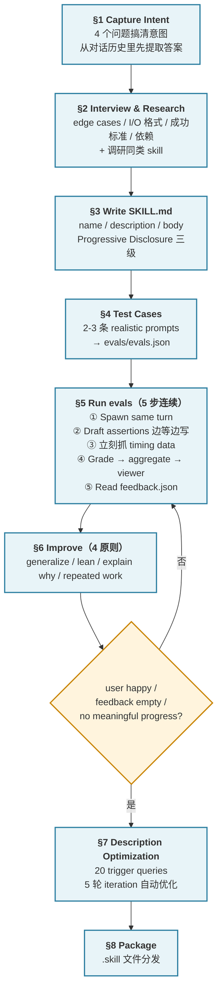

# Skill 官方开发流程

> 本文严格按 Anthropic 官方 [skill-creator SKILL.md](https://github.com/anthropics/skills/blob/main/skills/skill-creator/SKILL.md) 和 [Claude Code 官方 Skills 文档](https://code.claude.com/docs/en/skills) 整理，**不掺作者经验**。所有关键论断都给英文原文 + 中文翻译，便于对照。
>
> 作者基于 kdev-memory 的实战补充见姐妹文档 [skill-开发通用流程.md](skill-开发通用流程.md)。
>
> 配套案例文档：[kdev-memory-开发历程技术分享.md](../skills/kdev-memory/开发历程.md)

---

## 0. Skill 是什么、什么时候该做

### 0.1 什么是 Skill

**一句话**：Skill 是一段带"触发条件"的指令文档。平时不在上下文里，当用户说的话命中它的 description 时，Claude 把这段文档读进当前对话，按里面写的规则行事。

官方表述：

> Skills extend what Claude can do. Create a `SKILL.md` file with instructions, and Claude adds it to its toolkit. Claude uses skills when relevant, or you can invoke one directly with `/skill-name`.

### 0.2 什么时候应该做一个 skill

官方给出三种信号：

> Create a skill when you keep pasting the same playbook, checklist, or multi-step procedure into chat, or when a section of CLAUDE.md has grown into a procedure rather than a fact.

翻译：

- 你反复把同一份 playbook / checklist 粘贴进对话
- CLAUDE.md 里某一节从"一条事实"长成了"一套流程"
- 需要的任务**多步 / 专业化**（简单一步任务 Claude 直接处理，不需要 skill，见下 §7.3 触发机制）

### 0.3 核心 loop（必须记住）

整个 skill-creator 最终收尾重复了一遍这个 loop：

> - Figure out what the skill is about
> - Draft or edit the skill
> - Run claude-with-access-to-the-skill on test prompts
> - With the user, evaluate the outputs
> - Repeat until you and the user are satisfied
> - Package the final skill and return it to the user

**Draft → Test → Review → Improve → Repeat**。全文所有章节都服务于这个循环。

---

## 全流程总览



**读图要点**：§1-§4 是准备 + 初稿；§5-§6 是**主循环**（evals 通不过就回去改）；§7 是收尾前的 description 专项优化；§8 是打包分发。

---

## 1. Capture Intent（搞清楚意图）

### 1.1 四个问题

官方要求先回答四个问题：

> 1. What should this skill enable Claude to do?
> 2. When should this skill trigger? (what user phrases/contexts)
> 3. What's the expected output format?
> 4. Should we set up test cases to verify the skill works?

翻译 + 注：

| 问题 | 注意点 |
|---|---|
| 这个 skill 让 Claude 能做什么？ | 用动词开头，具体可测 |
| 应该在什么情况下触发？ | 用户会用什么短语？什么上下文？ |
| 期望的输出格式是什么？ | 文件 / 结构化数据 / 解释性文本？ |
| 要不要搭测试用例？ | 见下 §1.2 |

### 1.2 是否需要测试用例（官方判据）

> Skills with objectively verifiable outputs (file transforms, data extraction, code generation, fixed workflow steps) benefit from test cases. Skills with subjective outputs (writing style, art) often don't need them.

翻译：

- **需要测试**：输出客观可验证的 skill（文件转换、数据提取、代码生成、固定流程步骤）
- **不一定需要**：输出主观的 skill（写作风格、艺术创作）——用人工定性评估即可

### 1.3 先从对话历史里提取答案

官方原文：

> The current conversation might already contain a workflow the user wants to capture (e.g., they say "turn this into a skill"). If so, extract answers from the conversation history first — the tools used, the sequence of steps, corrections the user made, input/output formats observed. The user may need to fill the gaps, and should confirm before proceeding to the next step.

关键：**不要凭空问用户**。如果当前对话已经在做一个工作流，先从历史里提取——用了哪些工具、步骤顺序、用户做过哪些纠正、观察到的 I/O 格式。只有历史里缺的才去问用户，最后让用户确认再进下一步。

---

## 2. Interview and Research

### 2.1 Interview：追问边界

官方原文：

> Proactively ask questions about edge cases, input/output formats, example files, success criteria, and dependencies. Wait to write test prompts until you've got this part ironed out.

要问的五类问题：

1. **边界情况**（edge cases）
2. **输入输出格式**
3. **示例文件**
4. **成功标准**（怎么算做对了）
5. **依赖**（需要什么工具 / 外部服务）

**纪律**：没问清楚前**不要写测试 prompt**。

### 2.2 Research：主流程里的正规一步

官方原文：

> Check available MCPs - if useful for research (searching docs, finding similar skills, looking up best practices), research in parallel via subagents if available, otherwise inline. Come prepared with context to reduce burden on the user.

要点：

- 可以查 MCPs（搜文档、找同类 skill、查最佳实践）
- 并行跑调研 subagent（如果有）
- **Come prepared with context**：带着上下文来，减轻用户负担

---

## 3. Write SKILL.md

### 3.1 目录结构（Anatomy of a Skill）

```
skill-name/
├── SKILL.md (required)
│   ├── YAML frontmatter (name, description required)
│   └── Markdown instructions
└── Bundled Resources (optional)
    ├── scripts/    - Executable code for deterministic/repetitive tasks
    ├── references/ - Docs loaded into context as needed
    └── assets/     - Files used in output (templates, icons, fonts)
```

三类 bundled resources 的区别：

| 目录 | 用途 | 何时加载 |
|---|---|---|
| `scripts/` | 可执行代码（确定性 / 重复性任务） | **执行时不占上下文**，Claude 调用 Bash 跑 |
| `references/` | 深度参考资料 | Claude 决定需要时才 Read |
| `assets/` | 输出会用到的文件（模板 / 图标 / 字体） | 生成输出时引用 |

### 3.2 Frontmatter 核心字段

官方要求必填的三件事：

```yaml
---
name: my-skill-name
description: [什么时候触发 + 做什么，都放这里]
---
```

- **`name`**：skill 标识，作 `/slash-command` 用（小写 + 连字符，最多 64 字符）
- **`description`**：**触发机制的唯一依据**——既说做什么，也说什么时候用
- **`compatibility`**（可选、很少需要）：必需的工具、依赖

> 官方原话："This is the primary triggering mechanism - include both what the skill does AND specific contexts for when to use it. All 'when to use' info goes here, not in the body."

**所有"何时使用"的信息都放在 description 里，不要放到 body**。

### 3.3 Description：官方建议"积极触发"（Pushy）

官方原话（非常重要，全引）：

> Currently Claude has a tendency to "undertrigger" skills -- to not use them when they'd be useful. To combat this, please make the skill descriptions a little bit "pushy". So for instance, instead of:
>
> "How to build a simple fast dashboard to display internal Anthropic data."
>
> you might write:
>
> "How to build a simple fast dashboard to display internal Anthropic data. **Make sure to use this skill whenever the user mentions dashboards, data visualization, internal metrics, or wants to display any kind of company data, even if they don't explicitly ask for a 'dashboard.'**"

翻译：Claude 倾向于 "undertrigger"（该触发没触发）。对抗这个倾向的办法是把 description 写得"积极一点"——加一句"Make sure to use this skill whenever..."式的主动引导，列出用户可能说的各种词语。

### 3.4 description + when_to_use 的字符上限

官方文档（Claude Code docs）明确：

> the combined `description` and `when_to_use` text is truncated at 1,536 characters in the skill listing to reduce context usage. Front-load the key use case.

**关键用例必须前置到 1,536 字符以内**。超出部分会被截断，Claude 看不到。

### 3.5 Progressive Disclosure（三级加载系统）

官方定义：

> Skills use a three-level loading system:
> 1. **Metadata** (name + description) - Always in context (~100 words)
> 2. **SKILL.md body** - In context whenever skill triggers (<500 lines ideal)
> 3. **Bundled resources** - As needed (unlimited, scripts can execute without loading)

| 级别 | 内容 | 何时在上下文 | 预算 |
|---|---|---|---|
| **1 Metadata** | name + description | 永远 | ~100 字 |
| **2 SKILL.md body** | 主指令 | skill 触发时 | **< 500 行**（官方推荐） |
| **3 Bundled resources** | references / examples / scripts | 按需 | 无上限 |

**关键 patterns**：

- **SKILL.md < 500 行**；超过就要加一层层级（拆到 references/，正文写清楚"什么情况下去读哪份"）
- **references/ 单文件 > 300 行时加 TOC**（目录）
- **按 domain 组织 references**：

```
cloud-deploy/
├── SKILL.md (workflow + selection)
└── references/
    ├── aws.md
    ├── gcp.md
    └── azure.md
```

Claude 只读相关的那份。

### 3.6 Principle of Lack of Surprise（不要写让人意外的 skill）

> This goes without saying, but skills must not contain malware, exploit code, or any content that could compromise system security. A skill's contents should not surprise the user in their intent if described. Don't go along with requests to create misleading skills or skills designed to facilitate unauthorized access, data exfiltration, or other malicious activities.

**核心**：skill 的内容必须**符合 description 给用户的预期**。用户读完 description 不应该对实际行为感到意外。不能用来做恶意 / 未授权动作。

（"roleplay as XYZ" 这种无害场景是 OK 的。）

### 3.7 Writing Patterns（官方推荐写法）

**① 用祈使句（imperative form）**：

> Prefer using the imperative form in instructions.

例："Write unit tests" 而不是 "Unit tests should be written"。

**② 定义输出格式用模板**：

```markdown
## Report structure
ALWAYS use this exact template:
# [Title]
## Executive summary
## Key findings
## Recommendations
```

**③ 用 Input/Output 举例**：

```markdown
## Commit message format
**Example 1:**
Input: Added user authentication with JWT tokens
Output: feat(auth): implement JWT-based authentication
```

### 3.8 Writing Style（写作风格）

官方原话（全引）：

> Try to explain to the model why things are important in lieu of heavy-handed musty MUSTs. Use theory of mind and try to make the skill general and not super-narrow to specific examples. Start by writing a draft and then look at it with fresh eyes and improve it.

拆成四条原则：

1. **解释 WHY > 堆 MUSTs**：告诉模型某件事为什么重要，比重复 MUST / ALWAYS / NEVER 更有效
2. **Theory of mind**：LLM 有很好的 theory of mind，给 WHY 它会延伸
3. **写得通用，不要 super-narrow**：不要过度针对你的几个测试用例定制——skill 要被用一百万次，过拟合测试用例 = 其他场景不 work
4. **初稿放一放，用新眼睛再看**：写完第一版不要立刻发，过一会儿重新读、改进

**Yellow flag**：发现自己在写大量 ALWAYS / NEVER 全大写——反思能否用"为什么"代替。

---

## 4. Test Cases

### 4.1 数量：2-3 条 realistic prompts

官方原话：

> After writing the skill draft, come up with 2-3 realistic test prompts — the kind of thing a real user would actually say. Share them with the user: "Here are a few test cases I'd like to try. Do these look right, or do you want to add more?" Then run them.

**2-3 条真实的 prompt**，不是 20 条。要写**真实用户会说的话**——不是抽象请求。

### 4.2 存到 `evals/evals.json`

官方 schema：

```json
{
  "skill_name": "example-skill",
  "evals": [
    {
      "id": 1,
      "prompt": "User's task prompt",
      "expected_output": "Description of expected result",
      "files": []
    }
  ]
}
```

**不要先写 assertions**——留到 §5 Step 2 里边跑边起草。

---

## 5. Running and Evaluating Test Cases（5 步连续，不要中断）

官方加粗：**"This section is one continuous sequence — don't stop partway through."**

结果放在 `<skill-name>-workspace/` 里，sibling to the skill directory：

```
<skill-name>-workspace/
└── iteration-1/
    └── eval-<descriptive-name>/
        ├── with_skill/outputs/
        ├── without_skill/outputs/   (创建新 skill 时)  OR  old_skill/outputs/  (改进现有 skill 时)
        ├── eval_metadata.json
        ├── timing.json
        └── grading.json
```

**不要事先创建全部目录**——边走边建。

### Step 1：同一轮里一起 spawn 所有 runs（with-skill + baseline）

官方加粗：**"don't spawn the with-skill runs first and then come back for baselines later. Launch everything at once so it all finishes around the same time."**

**With-skill run** 任务描述：

```
Execute this task:
- Skill path: <path-to-skill>
- Task: <eval prompt>
- Input files: <eval files if any, or "none">
- Save outputs to: <workspace>/iteration-<N>/eval-<ID>/with_skill/outputs/
- Outputs to save: <what the user cares about — e.g., "the .docx file", "the final CSV">
```

**Baseline run** 两种情况：

| 情况 | 基线是什么 | 存在哪 |
|---|---|---|
| 创建新 skill | 不用任何 skill，same prompt | `without_skill/outputs/` |
| 改进现有 skill | 老版本——编辑前先 `cp -r <skill-path> <workspace>/skill-snapshot/`，baseline subagent 指向 snapshot | `old_skill/outputs/` |

每个 test case 写一份 `eval_metadata.json`（assertions 先空着）：

```json
{
  "eval_id": 0,
  "eval_name": "descriptive-name-here",
  "prompt": "The user's task prompt",
  "assertions": []
}
```

**官方纪律**：eval 取**描述性名字**——不要用 `eval-0`，要用能在 benchmark viewer 里一眼看清"这测的是什么"的名字。

### Step 2：runs 跑着的同时起草 assertions

> Don't just wait for the runs to finish — you can use this time productively.

好 assertion 的三条标准：

1. **Objectively verifiable**（客观可验证）
2. **有描述性的名字**（benchmark viewer 里一眼看清）
3. **Subjective skills**（写作风格、设计质量）不要硬上 assertion——用定性评估

写完 assertions 更新回 `eval_metadata.json` 和 `evals/evals.json`。

### Step 3：run 完成时**立刻**抓 timing data

官方原话（重要）：

> When each subagent task completes, you receive a notification containing `total_tokens` and `duration_ms`. Save this data immediately to `timing.json` in the run directory... This is **the only opportunity** to capture this data — it comes through the task notification and isn't persisted elsewhere.

```json
{
  "total_tokens": 84852,
  "duration_ms": 23332,
  "total_duration_seconds": 23.3
}
```

**错过通知 = 数据永远拿不到**。每个通知单独处理，不要攒着。

### Step 4：Grade → Aggregate → 启动 Viewer

#### 4.1 Grade each run

Spawn grader subagent（读 `agents/grader.md`）评估每条 assertion。存到每个 run 目录下的 `grading.json`。

官方硬性要求：**`grading.json` 的 `expectations` 数组必须用字段 `text` / `passed` / `evidence`**——不是 `name` / `met` / `details` 或其他变体。viewer 依赖这些字段名。

**能程序化检查的 assertion 写脚本跑**——不要肉眼看。更快、更可靠、可跨 iteration 复用。

#### 4.2 Aggregate

```bash
python -m scripts.aggregate_benchmark <workspace>/iteration-N --skill-name <name>
```

生成 `benchmark.json` + `benchmark.md`——pass_rate / time / tokens per configuration，含 mean ± stddev + delta。**with_skill 排在 baseline 前面**。

#### 4.3 Analyst pass

读 benchmark 数据，挖**聚合统计可能藏住的模式**：

- 不管用不用 skill 都通过的 assertion（non-discriminating）
- 高方差的 eval（可能 flaky）
- 时间 / token 权衡

详见 `agents/analyzer.md` 的 "Analyzing Benchmark Results" 节。

#### 4.4 Launch viewer

```bash
nohup python <skill-creator-path>/eval-viewer/generate_review.py \
  <workspace>/iteration-N \
  --skill-name "my-skill" \
  --benchmark <workspace>/iteration-N/benchmark.json \
  > /dev/null 2>&1 &
VIEWER_PID=$!
```

**Iteration 2+** 加 `--previous-workspace <workspace>/iteration-<N-1>` 让用户看到历次对比。

**无显示环境**（Cowork 等）用 `--static <output_path>` 生成独立 HTML。

**官方强调**（全大写原话）：

> GENERATE THE EVAL VIEWER *BEFORE* evaluating inputs yourself. You want to get them in front of the human ASAP!

**先生成 viewer 给人看，再自己开始改 skill**。

### Step 5：读 `feedback.json`

用户提交后的文件：

```json
{
  "reviews": [
    {"run_id": "eval-0-with_skill", "feedback": "the chart is missing axis labels", "timestamp": "..."},
    {"run_id": "eval-1-with_skill", "feedback": "", "timestamp": "..."},
    {"run_id": "eval-2-with_skill", "feedback": "perfect, love this", "timestamp": "..."}
  ],
  "status": "complete"
}
```

**空 feedback = 用户觉得没问题**。集中精力改有具体 complaint 的那几条。

完事后关 viewer：

```bash
kill $VIEWER_PID 2>/dev/null
```

---

## 6. Improving the skill（4 条核心改进原则）

这是官方"the heart of the loop"——最重要的一节。4 条原则逐条展开：

### 6.1 Generalize from feedback（不要过拟合测试用例）

官方原话：

> ...we're trying to create skills that can be used a million times... across many different prompts. Here you and the user are iterating on only a few examples over and over again because it helps move faster... But if the skill you and the user are codeveloping works only for those examples, it's useless.

**关键**：你只在 3 个测试用例上迭代**是为了加快速度**，但 skill 要能用在**一百万次不同的 prompt** 上。如果改进只对这 3 个例子有效，skill 就没用。

**反模式**：

- Fiddly overfitty changes（针对某个测试用例的精修）
- Oppressively constrictive MUSTs（针对某个失败硬加 MUST）

**正模式**：

> If there's some stubborn issue, you might try branching out and using different metaphors, or recommending different patterns of working. It's relatively cheap to try and maybe you'll land on something great.

遇到顽固问题，试试**换个比喻 / 换个推荐的工作模式**——相对便宜，可能撞出好东西。

### 6.2 Keep the prompt lean（保持精简）

官方原话：

> Remove things that aren't pulling their weight. Make sure to read the transcripts, not just the final outputs — if it looks like the skill is making the model waste a bunch of time doing things that are unproductive, you can try getting rid of the parts of the skill that are making it do that and seeing what happens.

**关键**：

- **不要只看最终输出，读 transcripts（完整过程）**
- 看到 model 浪费时间做无用功 → 删掉导致这个的 skill 片段试试
- 删掉没贡献的内容

### 6.3 Explain the WHY（解释原因）

官方原话（前面 §3.8 已引过，这里再强调）：

> Try hard to explain the **why** behind everything you're asking the model to do. Today's LLMs are *smart*. They have good theory of mind and when given a good harness can go beyond rote instructions and really make things happen.

**具体判据（yellow flag）**：

> If you find yourself writing ALWAYS or NEVER in all caps, or using super rigid structures, that's a yellow flag — if possible, reframe and explain the reasoning so that the model understands why the thing you're asking for is important.

全大写 ALWAYS / NEVER 或过度刚性结构 = yellow flag，反思能不能改成解释原因。

### 6.4 Look for repeated work across test cases（打包成脚本）

官方原话：

> Read the transcripts from the test runs and notice if the subagents all independently wrote similar helper scripts or took the same multi-step approach to something. If all 3 test cases resulted in the subagent writing a `create_docx.py` or a `build_chart.py`, that's a strong signal the skill should bundle that script.

**做法**：

- 读所有 test run 的 transcripts
- 看 subagent 们是不是独立写了相似的 helper script
- 如果是 → 把脚本**一次性写好放 `scripts/`**，skill 里让 subagent 直接用
- 省掉每次 invocation 都 reinventing the wheel

### 6.5 迭代 loop

官方说：

> Keep going until:
> - The user says they're happy
> - The feedback is all empty (everything looks good)
> - You're not making meaningful progress

三种停止条件之一达成就停。每次迭代新开 `iteration-<N+1>/` 目录，带 `--previous-workspace` 启动 viewer 给用户做对比。

---

## 7. Description Optimization（独立流程，skill 完成后做）

Description 是**唯一**决定 Claude 是否 invoke skill 的机制。skill-creator 为此做了专门的自动化优化流程。

### 7.1 Step 1：生成 20 条 trigger eval queries

**数量**：8-10 条 should-trigger + 8-10 条 should-NOT-trigger，总计 20 条。

**质量要求**：

> The queries must be realistic and something a Claude Code or Claude.ai user would actually type. Not abstract requests, but requests that are concrete and specific and have a good amount of detail. For instance, file paths, personal context about the user's job or situation, column names and values, company names, URLs. A little bit of backstory. Some might be in lowercase or contain abbreviations or typos or casual speech.

**好的 query vs 坏的 query**：

坏 ❌：`"Format this data"`, `"Extract text from PDF"`, `"Create a chart"`

好 ✅：`"ok so my boss just sent me this xlsx file (its in my downloads, called something like 'Q4 sales final FINAL v2.xlsx') and she wants me to add a column that shows the profit margin as a percentage. The revenue is in column C and costs are in column D i think"`

**should-trigger 的覆盖策略**：

> You want different phrasings of the same intent — some formal, some casual. Include cases where the user doesn't explicitly name the skill or file type but clearly needs it. Throw in some uncommon use cases and cases where this skill competes with another but should win.

**should-NOT-trigger 的关键**（易错）：

> The most valuable ones are the near-misses — queries that share keywords or concepts with the skill but actually need something different. Think adjacent domains, ambiguous phrasing where a naive keyword match would trigger but shouldn't, and cases where the query touches on something the skill does but in a context where another tool is more appropriate.
>
> The key thing to avoid: don't make should-not-trigger queries obviously irrelevant. "Write a fibonacci function" as a negative test for a PDF skill is too easy — it doesn't test anything. **The negative cases should be genuinely tricky.**

**核心**：should-NOT 要用**近似难辨（near-miss）** 的 query——共享关键词但实际需要别的工具。"写斐波那契函数"当 PDF skill 的负例太蠢，什么都没测到。

存为 JSON：

```json
[
  {"query": "the user prompt", "should_trigger": true},
  {"query": "another prompt", "should_trigger": false}
]
```

### 7.2 Step 2：让用户 review 这份 eval set

用 `assets/eval_review.html` 模板：

1. 读模板
2. 替换 3 个占位符（`__EVAL_DATA_PLACEHOLDER__` / `__SKILL_NAME_PLACEHOLDER__` / `__SKILL_DESCRIPTION_PLACEHOLDER__`）
3. 写到 `/tmp/eval_review_<skill-name>.html` 并打开
4. 用户可以编辑 query / toggle should-trigger / 增删 / 点 "Export Eval Set"
5. 文件下载到 `~/Downloads/eval_set.json`

官方强调：**"This step matters — bad eval queries lead to bad descriptions."**

### 7.3 Step 3：跑优化 loop（自动化）

```bash
python -m scripts.run_loop \
  --eval-set <path-to-trigger-eval.json> \
  --skill-path <path-to-skill> \
  --model <model-id-powering-this-session> \
  --max-iterations 5 \
  --verbose
```

官方解释内部机制：

> It splits the eval set into 60% train and 40% held-out test, evaluates the current description (**running each query 3 times to get a reliable trigger rate**), then calls Claude with extended thinking to propose improvements based on what failed. It re-evaluates each new description on both train and test, iterating up to 5 times. When it's done, it opens an HTML report in the browser showing the results per iteration and returns JSON with `best_description` — **selected by test score rather than train score to avoid overfitting**.

关键设计：

- **60/40 train/test split**
- **每条 query 重复跑 3 次**（控制方差，得到稳定 trigger rate）
- **Claude with extended thinking** 提改进方案
- 最多 5 轮
- **best_description 按 test score（held-out）选，不是 train score**——防 overfitting

### 7.4 重要认知：How Skill Triggering Works

官方原话（非常重要，容易忽略）：

> Skills appear in Claude's `available_skills` list with their name + description, and Claude decides whether to consult a skill based on that description. The important thing to know is that **Claude only consults skills for tasks it can't easily handle on its own — simple, one-step queries like "read this PDF" may not trigger a skill even if the description matches perfectly**, because Claude can handle them directly with basic tools. Complex, multi-step, or specialized queries reliably trigger skills when the description matches.

**关键认知**：

- **简单一步任务即使 description 完美匹配也不会触发 skill**（Claude 直接处理）
- **只有多步 / 专业化任务**在 description 匹配时会稳定触发

**推论**：

> This means your eval queries should be substantive enough that Claude would actually benefit from consulting a skill. Simple queries like "read file X" are poor test cases — they won't trigger skills regardless of description quality.

写 eval query 时要让任务**足够 substantive**——"读文件 X" 这类简单 query 无论 description 多好都不会触发，测不出任何东西。

### 7.5 Step 4：应用结果

取 `best_description` 替换到 `SKILL.md` frontmatter，给用户看 before/after + scores。

---

## 8. Package（可选收尾）

如果有 `present_files` 工具，打包成 `.skill` 文件给用户安装：

```bash
python -m scripts.package_skill <path/to/skill-folder>
```

官方：没这个工具就跳过这步。

---

## 9. 高级：Blind Comparison（可选）

场景：用户问"新版本真的比老版本好吗？"时用。

> The basic idea is: give two outputs to an independent agent without telling it which is which, and let it judge quality. Then analyze why the winner won.

**可选、需要 subagent、大多数用户不需要**。人工 review loop 通常够用。详情读 `agents/comparator.md` 和 `agents/analyzer.md`。

---

## 10. 平台差异（Claude.ai / Cowork）

### 10.1 Claude.ai

- **无 subagent** → 测试用例**串行跑**，不能并行
- 每条 test case：自己读 SKILL.md → 按指令执行 test prompt → 一条条做
- 跳过 baseline runs（不带 skill 那组）
- **无 browser** → 跳过 viewer，在对话里直接展示结果，文件存到 fs 让用户下载检查
- **跳过 benchmarking**（没 baseline 对比意义不大）→ 只做定性反馈
- **跳过 Description Optimization**（要 `claude` CLI，Claude.ai 没有）
- **跳过 Blind Comparison**（要 subagent）
- **Packaging 照常**（只要 Python + filesystem）

### 10.2 Cowork

- **有 subagent**，主流程照 Claude Code 跑
- 遇超时问题可以串行跑测试
- **无 display** → viewer 用 `--static <output_path>` 生成独立 HTML，给用户点击链接
- 官方全大写强调：**GENERATE THE EVAL VIEWER *BEFORE* 自己评估输出**
- Feedback 靠 "Submit All Reviews" 下载 `feedback.json` 文件
- Description Optimization 能跑（用 `claude -p` 子进程），但**等 skill 完全定型 + 用户同意再做**

---

## 11. Troubleshooting（官方三类常见故障）

摘自 Claude Code 官方 Skills 文档：

### 11.1 Skill **该触发却没触发**

1. 检查 description 是否包含用户会自然说的关键词
2. 让 Claude 回答 "What skills are available?" 验证是否被加载
3. 换种说法重新请求，让它更贴近 description
4. 如果 user-invocable，直接用 `/skill-name` 调用

### 11.2 Skill **过度触发**

1. description 写得**更具体**（缩窄触发条件）
2. 加 `disable-model-invocation: true`（只允许手动触发）

### 11.3 Description **被截断**

1. 设 `SLASH_COMMAND_TOOL_CHAR_BUDGET` 环境变量放大预算
2. 或**关键用例前置**到 1,536 字符以内（description + when_to_use 合计上限）

---

## 12. Reference 文件（skill-creator 自带）

### agents/（specialized subagent 指令）

| 文件 | 用途 |
|---|---|
| `agents/grader.md` | 如何用 assertion 给 output 打分 |
| `agents/comparator.md` | Blind A/B 两个 output 怎么比 |
| `agents/analyzer.md` | 为什么一个 version 赢了另一个 |

### references/

| 文件 | 用途 |
|---|---|
| `references/schemas.md` | `evals.json` / `grading.json` / `benchmark.json` 的完整 JSON schema |

---

## 13. 一句话记住

> **Skill 不是写出来就完的。skill-creator 的核心是 `Draft → Test → Review → Improve → Repeat` 的循环——evals 是循环的燃料，description optimization 是收尾的校准。缺任何一环都是半成品。**

---

## 14. 相关资料

- **官方源头**：
  - [Claude Code Skills 文档](https://code.claude.com/docs/en/skills) —— frontmatter 完整字段表 / lifecycle / troubleshooting
  - [anthropics/skills 仓库](https://github.com/anthropics/skills) —— skill-creator 源码 + 示例 skill
  - [skill-creator SKILL.md](https://github.com/anthropics/skills/blob/main/skills/skill-creator/SKILL.md) —— 本文的主要依据
  - [Agent Skills 开放标准](https://agentskills.io)

- **本仓库内姐妹文档**：
  - [skill-开发通用流程.md](skill-开发通用流程.md) —— 作者基于 kdev-memory 的实战补充（含 hook 分层 / 严格度 opt-in / 依赖最小化等官方没讲的工程经验）
  - [kdev-memory-开发历程技术分享.md](../skills/kdev-memory/开发历程.md) —— 一个真实 skill 项目的 10 天迭代故事
