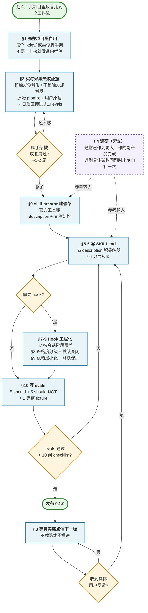

# Skill 开发通用流程

> **本文是对官方文档的实战化补充，不是替代品。**
>
> 权威来源请读：
> - [Claude Code 官方 Skills 文档](https://code.claude.com/docs/en/skills) —— frontmatter 字段完整清单、lifecycle、troubleshooting
> - [anthropics/skills](https://github.com/anthropics/skills) —— skill-creator 源码 + 各类 skill 示例
> - [skill-creator 的完整 SKILL.md](https://github.com/anthropics/skills/blob/main/skills/skill-creator/SKILL.md) —— Progressive Disclosure、Evals workflow、Description Optimization 的官方定义
>
> 本文补充的是：
> 1. 把上面那些材料浓缩到一张图 + 10 步的**决策流程**（带具体判断点）
> 2. 一个真实项目 **kdev-memory** 从自用脚手架到插件 0.3.0 的 10 天实战故事，可作为每一步的"实例锚点"（详见 [kdev-memory 开发历程技术分享](../skills/kdev-memory/开发历程.md)）
> 3. 官方没明说、但实战里会遇到的几件事：hook 按会话阶段覆盖（§7）、严格度分级 opt-in（§8）、调研作为副产品（§4）
>
> **如果只想快速建一个 skill**：读官方文档 + 跑 `skill-creator` 就够了。
> **如果想避开踩过的坑**：本文提供决策流程 + 实战证据。

---

## 先决知识：什么是 Skill？

> 如果你已经熟悉 Claude Code 的 Skill 机制，跳过这节。

### 一句话定义

**Skill 是一段带"触发条件"的指令文档**。平时不加载，当用户说的话命中它的触发描述时，Claude 自动把这段文档读进当前对话，然后按里面写的规则行事。

可以理解成：Claude 的"按需加载的专业知识包"——不是规则书（规则书每次会话都要加载），而是"用到时才打开看一眼"的手册。

### 最小例子

一个叫 `say-hello` 的 skill，文件结构只有一个文件：

```
say-hello/
└── SKILL.md
```

`SKILL.md` 的内容：

```markdown
---
name: say-hello
description: 当用户说"打招呼 / 问好 / hello"时使用这个 skill，用三种语言回应。
---

# Say Hello

用户要求打招呼时，回应三句话：

1. 中文：你好
2. 英文：Hello
3. 日文：こんにちは
```

用户在 Claude Code 里说"帮我打个招呼"，Claude 会**自动触发**这个 skill（因为 description 命中了"打招呼"），然后照指令输出三种语言。

### 一份 SKILL.md 的基本结构（两块）

**1. YAML frontmatter（文件开头的 `---` 之间）——必需**

- `name` —— skill 的唯一名字
- `description` —— 描述这个 skill 做什么 + **什么情况下应该触发它**
- （`description` 是 Claude 决定要不要召唤这个 skill 的**唯一依据**。写不好就永远不被触发——这是 skill 作者最常见的失败。本文 §5 专门讲这件事。）

**2. Markdown 正文——必需**

Skill 被召唤后，Claude 实际读进上下文的指令内容。可以是规则、步骤、示例、边界条件等。

### 稍复杂一点：可选的附加文件

复杂 skill 可以带附加资源，按需加载，不会默认塞进上下文：

```
my-skill/
├── SKILL.md              # 必需，主指令
├── references/           # 深度参考资料（Claude 需要时自己 Read）
│   └── schemas.md
├── examples/             # 具体用例
│   └── example-1.md
└── scripts/              # 可执行脚本
    └── validate.py
```

**原则**：SKILL.md 主体只放核心规则，细节塞到 references/examples，让 Claude 按需展开。本文 §6 讲这个。

### Skill vs 其他几个容易混的概念

| 名称 | 谁触发 | 是否默认加载 | 典型用途 |
|---|---|---|---|
| **Skill** | Claude 判断描述是否命中 | ❌ 只在匹配时 | 按需专业知识 |
| **Slash Command**（`/xxx`） | 用户显式敲命令 | ✅ 每次执行都加载 | 显式触发的工作流 |
| **Hook** | 系统事件（Stop / PreCompact / 用户发 prompt 等） | 不注入上下文，而是跑外部脚本 | 自动化后台动作 |
| **CLAUDE.md** | 总是加载 | ✅ 每次会话都加载 | 永恒不变的项目规则 |

一句话对比：**CLAUDE.md 是宪法（总是在），Skill 是图书（需要时翻），Slash Command 是仪式（用户主动发起），Hook 是后台进程（系统自动跑）**。

### 装在哪、怎么试

- **用户级**：`~/.claude/skills/<name>/SKILL.md`（所有项目都能用）
- **项目级**：`<project>/.claude/skills/<name>/SKILL.md`（只本项目）
- **插件自带**：通过 `claude plugin install` 安装的插件会自动带上它的 skills

验证是否生效的办法：创建一个 `SKILL.md` → 在 Claude Code 里说一句命中它 description 的话 → 观察 Claude 是否按 skill 里写的规则行事。

### 为什么需要"Skill 开发流程"这样一份文档

Skill 看起来就是一个 markdown 文件，写个 description + 写些规则就完事——但**写出来能被正确触发、真的改变 Claude 行为、长期不回归**，比想象中难得多。

接下来的 10 步就是一份可操作的路线图，帮你避开最常见的失败模式。

---

## 前置：官方文档里必须先知道的几件事

> 本节内容全部来自 [Claude Code 官方 Skills 文档](https://code.claude.com/docs/en/skills) 和 [skill-creator 的 SKILL.md](https://github.com/anthropics/skills/blob/main/skills/skill-creator/SKILL.md)。如果你还没读过官方源头，**先读一遍再回来**。本节只抽几件最核心、最容易被忽略的设定。

### 1. Frontmatter 的关键字段

核心 3 个（常用）：

| 字段 | 作用 |
|---|---|
| `name` | skill 的名字，也是 `/slash-command` |
| `description` | **Claude 决定要不要召唤的唯一依据** |
| `when_to_use`（可选） | 补充触发线索 |

> ⚠️ `description + when_to_use` 合计**被截断在 1,536 字符**。关键用例必须前置。

控制型字段（按需）：

| 字段 | 什么时候用 |
|---|---|
| `disable-model-invocation: true` | 只允许用户手动 `/name` 触发（deploy / commit 等有副作用的任务） |
| `user-invocable: false` | 只允许 Claude 自动触发（legacy-knowledge 这类背景知识，不给用户当命令） |
| `allowed-tools` | 预授权工具，skill 活跃时不用每次请求权限 |
| `context: fork` | 在独立 subagent 里跑，隔离上下文 |
| `paths` | 按文件路径 glob 限定只有编辑特定文件时才激活 |
| `effort` | 覆盖本次会话的 effort 级别（low/medium/high/xhigh/max） |

完整字段表见[官方 Frontmatter reference](https://code.claude.com/docs/en/skills#frontmatter-reference)。

### 2. Progressive Disclosure 是**三级**（不是两级）

| 级别 | 内容 | 何时加载 | 大小预算 |
|---|---|---|---|
| **1 Metadata** | name + description | 永远在上下文 | ~100 字 |
| **2 SKILL.md body** | 主指令 | skill 触发时 | < 500 行（官方推荐上限） |
| **3 Bundled resources** | references/ examples/ scripts/ | Claude 按需读；scripts 执行时不占上下文 | 无上限 |

原则（官方原话）：

> Keep SKILL.md under 500 lines; if you're approaching this limit, **add an additional layer of hierarchy** along with clear pointers about where the model using the skill should go next to follow up.

**SKILL.md 超过 500 行 → 必须分层**（拆到 references/*.md，正文写清楚"何时去读哪份"）。references 单文件超过 300 行时官方还要求加 TOC（目录）。

### 3. 官方 Writing Style：解释 WHY，不要堆 MUSTs

原话：

> Try to explain to the model why things are important in lieu of heavy-handed musty MUSTs. Use theory of mind and try to make the skill general and not super-narrow to specific examples.

翻译：**解释"为什么"比重复 MUST / ALWAYS / NEVER 更有效**。

- LLMs 有好的 theory of mind，给 WHY 它会延伸；只给 MUST 容易死板
- 发现自己在大量写 ALWAYS / NEVER 全大写 → **yellow flag**，反思能不能用"为什么"代替

### 4. Skill 内容的两种类型（务必分清）

| 类型 | 特征 | 推荐 frontmatter |
|---|---|---|
| **Reference content**（参考型） | 给 Claude 加知识——约定、模式、风格指南、领域知识 | 保持默认（Claude 自动触发） |
| **Task content**（任务型） | 给 Claude 具体步骤——部署、commit、代码生成等**有副作用**的动作 | **加 `disable-model-invocation: true`** |

不分清两类的典型错误：把"部署"写成参考型 → Claude 看到"代码似乎可以发了"就自动触发 deploy skill → 事故。

### 5. 官方推荐的写法模式

**用祈使句（imperative form）**："Write unit tests" 而不是 "Unit tests should be written"。

**定义输出格式用模板**：

```markdown
## Report structure
ALWAYS use this exact template:
# [Title]
## Executive summary
## Key findings
```

**用 Input/Output 举例**：

```markdown
## Commit message format
**Example 1:**
Input: Added user authentication with JWT tokens
Output: feat(auth): implement JWT-based authentication
```

### 6. 官方 Troubleshooting 三类常见故障

| 故障 | 官方解法 |
|---|---|
| Skill **该触发却没触发** | ① description 检查关键词；② 让 Claude "列出可用 skills" 验证是否被加载；③ 换种用户更常说的话；④ 直接 `/skill-name` 调用 |
| Skill **过度触发** | description 写得更具体；或加 `disable-model-invocation: true` |
| **description 被截断** | 设 `SLASH_COMMAND_TOOL_CHAR_BUDGET` 环境变量放大预算；或把**关键用例前置**到 1,536 字符以内 |

### 7. 还有一些官方重要机制（一笔带过，按需查官方）

- **`$ARGUMENTS` / `$N` 参数替换**：`/fix-issue 123` 里的 `123` 通过 `$ARGUMENTS` 或 `$0` 传给 skill
- **动态上下文注入**：SKILL.md 里写 `` !`gh pr diff` `` 或 ` ```! ` 代码块，会先执行 shell 命令、把 stdout 替换进去再给 Claude
- **Skill 的 lifecycle**：触发时以单条消息进入会话，**不会每轮重读文件**（要永远生效的写法请写成 standing instructions）
- **Auto-compaction 保留**：压缩后每个 skill 的最近一次调用保留前 5,000 token，多 skill 共享 25,000 token 预算
- **Enterprise / personal / project / plugin 四种安装位置**：优先级 enterprise > personal > project，plugin 走独立命名空间

---

## 全流程速览（一图看完）



**三条关键回路**（读图时重点看）：

1. **证据累积回路**（§2 ↔ Ready 判断）：脚手架在真项目里跑够一段时间才抽插件，不凭感觉
2. **evals 迭代回路**（§10 Iterate ↔ §5-6）：每次改完 SKILL.md / hook 都要跑 evals，不通过就回去改 description
3. **版本催生回路**（Release → §3 Wait → Write）：发了 0.1.0 后**等用户反馈再做下一版**，不按路线图硬推

**§4 调研的特殊位置**：不在主流上，是旁支——因为调研多数时候**在你决定做 skill 之前就已经顺带完成了**（见 §4 详述）。只有遇到具体架构问题时才需要专门补调研，此时它作为 **"参考输入"** 喂给 §0 或 §5-6。

**节点颜色含义**：**蓝色**（§0 / §5-6 / §10 等）= skill-creator 直接提供工具的地方；**绿色**（Start / Release）= 项目里程碑；**黄色菱形** = 需要诚实自检的判断点；**紫色虚线**（§4）= 旁支活动，非必经。

---

## 零、先说 `skill-creator`：这份流程的基座

**如果本文只能记住一个名字，记住 `skill-creator`。**

`skill-creator` 是 Anthropic 官方出的 skill，专门用来**建 skill / 改 skill / 评估 skill**。它不只是"一个模板"，它是一个完整的**元工具链（建工具的工具）**：

| 能力 | 对应脚本 | 解决什么问题 |
|---|---|---|
| 写 SKILL.md 脚手架 | `package_skill.py` | 文件结构不用自己造 |
| description 优化 | `improve_description.py` | skill 写好了却不被触发——这是最常见失败模式 |
| 跑 evals（测试集） | `run_eval.py` / `run_loop.py` | 量化"基线（Claude 不带 skill）"和"装了 skill"的效果差 |
| 生成评估报告 | `generate_report.py` / `aggregate_benchmark.py` | 把主观"看着还行"变成可复核的数据 |

**为什么重要**：没跑过 `skill-creator` 做出来的 skill，常常是两种失败：

- 🔴 **写出来了但永远不被触发**（description 没踩到用户真实 prompt 的关键词）
- 🔴 **触发了但没效果**（没 evals 验证，改进和退化自己都不知道）

`skill-creator` 的核心哲学是 **evaluate → rewrite → repeat 的迭代循环**，而不是"写完就行"。这份通用流程的后半段（第 5-10 步）都是建立在它之上的。

**官方仓库**：[anthropics/skills](https://github.com/anthropics/skills) — 里面有完整的 skill-creator 源码 + 示例 skill。

---

## 一、先在真项目里自用，不以"做通用插件"起步

### 反例

"我觉得应该做一个通用的 XX 插件" → 凭空画 PRD → 开 repo → 设计数据模型 → 写 hook 框架 → 跑不起来 → 放弃。

### 为什么这样对

- 真项目里用过 = **机制已经验证**，不是"我觉得会有用"
- 真项目里踩过的坑 = **文档里的每条规则都有来源**，不是抽象推演
- 用户主动要 = **需求信号真实**，不是你一个人觉得

### skill-creator 对应

skill-creator 的 "Capture Intent" 阶段第一句话就是：

> The current conversation might already contain a workflow the user wants to capture (e.g., they say "turn this into a skill"). If so, extract answers from the conversation history first.

**它也不鼓励凭空造 skill——它鼓励从"已经在发生的工作流"里抽出来**。

> 📎 **kdev-memory 案例**：从 token-statistics 的 `.kdev/` 脚手架跑了 10 天 / 4 迭代后才抽成插件，完整时间线见 [kdev-memory 开发历程 §1](../skills/kdev-memory/开发历程.md#1-真实起源从-token-statistics-sprint-0-实战验证项目长出来的)。

---

## 二、实时采集失败证据 —— 别凭感觉改 skill

Skill 开发最容易踩的坑：**改完自己跑两遍感觉不错就发版**——结果用户用的时候才发现触发不了 / 触发了又乱输出。要避免这一点，就得在 §1 的自用阶段就**把失败场景的原始证据记下来**。

### 三件必须**实时**记的事

1. **Claude 该触发却没触发** → 记下用户当时的完整 prompt
2. **Claude 不该触发却触发了** → 记下用户当时的完整 prompt（尤其是用户贴了代码/错误堆栈/文档的场景）
3. **Claude 触发了但输出不对** → 记下用户的反馈原话（"不是我要的" / "又漏了一条" / "应该 A 但它给了 B"）

为什么要**实时**：事后补写会失真（用户当时的原话、上下文细节都会被你"合理化"掉）。原始 prompt 和原始反馈是 §10 evals 的**唯一原料**——现在偷懒不记，以后写 evals 就没素材。

### 这和 skill 开发怎么对应

| 场景 | 直接改什么 |
|---|---|
| 该触发没触发 | 改 §5 description（加关键词 / 积极触发措辞） |
| 不该触发却触发 | 加 sanitize 规则 / 缩窄 description |
| 触发了但输出不对 | 改 SKILL.md 正文的规则 / 加示例 |
| 某些时机下 hook 不生效 | 改 §7 hook 覆盖 |

**原话 = 定位信号**。记"用户说'又不触发了'"没用，记**当时用户的完整 prompt** 才能反推 description 哪个词没踩到。

> 📎 **kdev-memory 案例**：项目内建 `改进建议.md`，每次 skill 表现不如预期就追加一条（原始 prompt + 实际 vs 期望 + 用户原话）。积累若干条后迁移到 `evals/` 测试集——**现场证据直接变回归测试**。详见 [kdev-memory 开发历程 §6.1](../skills/kdev-memory/开发历程.md#61-双评分机制防止智能体的讨好式满分)。

### 反例

"改完跑了几次感觉不错，发了" → 3 天后用户说"skill 还是不触发" → 回去翻聊天记录找当时的 prompt → 找不到 → 凭印象改 description → 再发一版 → 之前修好的场景偷偷回归了也不知道。

---

## 三、被真实痛点逼着迭代，不按路线图

### 反例

开项目前排好 0.1 → 0.2 → 0.3 的功能路线图，按图推进。

### 判据

**没有具体痛点 → 不要出新版。** 凑新版会导致功能堆砌，长期会失控。

每一版发布后回看，应该能说出**这一版是为了解决谁的哪句反馈**。如果说不出，这一版大概率是凑出来的。

> 📎 **kdev-memory 案例**：0.1 → 0.3 每一版都有具体催生点（如 0.2.0 来自"Spec Kit 跑两小时 Stop hook 没被读到"），详见 [kdev-memory 开发历程 §4](../skills/kdev-memory/开发历程.md#4-版本迭代故事真实的成长线)。

---

## 四、调研往往是"顺带做过的"，不是 skill 开发的独立一步

这是个反直觉的观察：**做 skill 需要的调研，大多数时候在你意识到要做这个 skill 之前就已经做过了**——作为更大范围工作的副产品。

### 启示

Skill 开发里的调研通常是这样一种状态：

- ✅ 你在做**更大范围的事**（架构设计、技术选型、读一篇博客、一次 tech share）时已经看过生态全景
- ✅ 某一天某个具体工作用到了其中一部分，**你把它抽成 skill**
- ❌ 不是：先决定做 skill → 然后调研 5-10 家 → 再开写

**skill 是调研成果的一种落地形式**——调研在前，skill 在后浮现。反过来做（先定 skill，再为这个 skill 调研）容易变成"功能表对比"，陷入"要不要把这个功能也加上"的干扰。

### 什么时候确实需要专门再调研

后续版本遇到具体架构问题时。**由具体痛点（§3）触发的二次调研**通常是必要的——这时你已经知道要回答什么问题，调研才有聚焦。

### 看调研时看什么（不看什么）

- ✅ 看：**每家是怎么解这个具体问题的**，设计 trade-off 是什么
- ✅ 看：**每家的核心定位**——他们卖的是 SQLite？是 LLM 摘要？是文件落盘？
- ❌ 不看：功能表对比（功能数量 ≠ 有用）
- ❌ 不抄最全的——差异化是**产品哲学差异**，不是功能数量差异

### skill-creator 对应

skill-creator 的 "Interview and Research" 阶段原文：

> Check available MCPs - if useful for research (searching docs, finding similar skills, looking up best practices), research in parallel via subagents if available. **Come prepared with context to reduce burden on the user.**

重点是 "**Come prepared with context**"——官方把调研定位为"来之前带好上下文"的**先决条件**，而不是"作为一个独立步骤完成"。

> 📎 **kdev-memory 案例**：memory 生态 6 家调研是 2026-04-08 做 KDev-Agent 融合架构时的副产品（早于 kdev-memory 这个概念 8 天）；0.2.0 的 PreCompact 专项调研才是"为版本而做"的二次调研。详见 [kdev-memory 开发历程 §5](../skills/kdev-memory/开发历程.md#5-横向调研我们从六家框架学到什么拒绝什么)。

---

## 五、description 是 skill 能否被自然召回的唯一锚点

这一条 **90% 的 skill 作者会踩**。

### 问题

- 你写了很好的 SKILL.md 正文
- 用户说了一个应该触发它的 prompt
- Claude **不触发你的 skill**

原因几乎总是：**description 没包含用户的真实口语词**。

### skill-creator 的一个具体技巧：积极触发的 description（官方叫 "Pushy Description"）

官方 SKILL.md 里有一段很直接的建议：

> Currently Claude has a tendency to "undertrigger" skills. To combat this, please make the skill descriptions a little bit "pushy". For instance, instead of:
>
> "How to build a simple fast dashboard to display internal Anthropic data."
>
> you might write:
>
> "How to build a simple fast dashboard to display internal Anthropic data. **Make sure to use this skill whenever the user mentions dashboards, data visualization, internal metrics, or wants to display any kind of company data, even if they don't explicitly ask for a 'dashboard.'**"

### 检查清单

写完 description 后自问：

- [ ] 包含用户会说的 **3-5 个口语词**（中英文都要）
- [ ] 包含用户会说的**场景词**，不只是**功能词**
- [ ] 是否**积极触发**（有"make sure to use this skill whenever..."式引导）
- [ ] 用 `skill-creator` 的 `improve_description.py` 跑一遍

> 📎 **kdev-memory 案例**：0.3.0 的 UserPromptSubmit 智能召回机制本质上是**给每条踩坑 / Step 条目加 description**（`triggers:` 字段）——让该触发的时候一定能触发。详见 [kdev-memory 开发历程 §6.3](../skills/kdev-memory/开发历程.md#63-triggers-字面匹配--sanitizedeterministic-且防误触)。

---

## 六、分层披露（Progressive Disclosure）：SKILL.md 不要一次塞 2000 行

### 反面

把 SKILL.md 写成一份 2000 行大纲：规则、示例、边界情况、FAQ、历史变更……所有内容一次性塞进去。

**后果**：Claude 每次触发都要读 2000 行，token 代价大；关键规则淹没在细节里。

### 正面

分层披露：

- **SKILL.md 主体** = 核心规则 + 触发时机（~300-500 行封顶）
- **references/** = 可选的深度参考（Claude 觉得需要才 Read）
- **examples/** = 具体用例（按需加载）
- **scripts/** = 可执行脚本（不塞进 prompt）

### 官方最佳实践

skill-creator 的 "Skill Writing Guide" 节：

```
skill-name/
├── SKILL.md (required)       ← 必须加载
│   ├── YAML frontmatter
│   └── Markdown instructions
└── Bundled Resources (optional)  ← 按需加载
    ├── references/
    ├── examples/
    └── scripts/
```

---

## 七、Hook / 触发机制按会话阶段覆盖，不强化单点

**只适用于需要 hook 的 skill / 插件。纯 skill 可以跳过这节。**

### 反例

"发现 Stop hook 没触发，那就把 Stop hook 做得更健壮" → 但问题是**用户在会话自然 idle 的场景下 Stop hook 本来就没有下一轮上下文可以读提醒**，加强再多也没用。

### 正面做法

**原则**：列出会话的不同阶段（新会话启动 / 活跃中 / 自然空闲 / 压缩前 / 结束 / 用户发 prompt），每个阶段**单独兜**，不要让一层承担所有。

**缺一层漏一种场景**——这个结论来自反复被用户反馈"xxx 场景下 hook 没触发"后才摸出来的。

> 📎 **kdev-memory 案例**：0.3.0 实际用了七层 hook 覆盖不同会话阶段（SessionStart / UserPromptSubmit / Stop / Strict / PostToolUse / PreCompact / SessionEnd），完整对照见 [kdev-memory 开发历程 §4.3-4.4](../skills/kdev-memory/开发历程.md#43-020--六层防线--yaml-frontmatter) 和 [kdev-memory README 的 Hook 章节](../../plugins/kdev-memory/README.md#hook-行为七层防线)。

---

## 八、严格度分级 + 默认关闭（opt-in，用户主动打开）

### 反例

一上来就 `exit 2` 硬阻塞 Claude → 用户在任何场景下都被提醒打断 → **2 分钟内卸载**。

### 正例（四档严格度）

```
静默 < 软提醒(stdout) < 条件阻塞(opt-in) < 兜底落盘(脚本直接写文件)
```

- **绝大多数场景用软提醒**
- **硬阻塞必须 opt-in**（如 `touch .kdev/strict` 启用）
- **兜底落盘是最后一道防线**，发生在用户看不见的地方

### 为什么重要

skill / 插件的首要目标是**被长期使用**。一个"功能强大但打扰"的插件长期留存率远低于"功能克制但不打扰"的。

---

## 九、依赖最小化 + 功能降级保护（graceful degradation）

### 硬指标

- **零 Node / npm / pip 包**（如果能做到）
- **缺关键依赖 → 静默降级，不报错**

### 为什么

- 安装链越长，被放弃的概率越高（每多一个依赖，放弃率×1.5）
- 这种"降级保护"让"部分功能失效"不等于"整个插件失效"

> 📎 **kdev-memory 案例**：主逻辑用 shell，结构化解析用系统自带 Python 3；缺 python3 时智能召回静默降级，其他 6 层 hook 继续工作。

---

## 十、Evals（测试集评估）是迭代循环的核心——skill-creator 自带全套工具

**这是 skill-creator 最容易被忽略的一部分。**

### evals 不是"看着不错"的替代品

没有 evals：

- 改一版 → 凭感觉觉得变好了 → 其实上一版的一些功能回归掉了你不知道
- 改五版之后无法回答"和 v0.1 比到底好在哪"

有 evals：

- 每次改动跑一遍 → 量化前后差异
- 回归掉的功能一眼看出来
- 新功能是否真的有效可以证明

### skill-creator 提供的 evals 套件

| 脚本 | 作用 |
|---|---|
| `run_eval.py` | 单个 prompt 跑 baseline + with-skill 对比 |
| `run_loop.py` | **Description Optimization**：按 5 轮 iteration 自动改 description（60/40 train/test split 防过拟合） |
| `aggregate_benchmark.py` | 多轮跑聚合（控制方差） |
| `generate_report.py` | 生成 HTML 报告给人看 |
| `quick_validate.py` | skill 写法的基础校验 |
| `package_skill.py` | 打包成 `.skill` 文件 |

### 官方完整 5 步 evals workflow（简要）

来自 [skill-creator SKILL.md "Running and evaluating test cases"](https://github.com/anthropics/skills/blob/main/skills/skill-creator/SKILL.md)：

1. **同一轮里一起 spawn 所有 runs**（with-skill + baseline 对照），**不要先跑 with-skill 再回头跑 baseline**
2. **runs 进行时同步起草 assertions**（等 runs 的时间不浪费）
3. **run 完成时立刻捕获 timing 数据**（total_tokens / duration_ms —— 只在通知里出现一次，过期就没了）
4. **用 grader subagent 打分 → aggregate → 启动 HTML viewer**（`generate_review.py`）给用户看
5. **读 `feedback.json`**，根据用户反馈迭代下一轮 iteration

关键纪律：

- 每个 eval 起个**描述性名字**，不要用 `eval-0`（在 benchmark viewer 里会一眼看清测的是什么）
- 能程序化检查的 assertion **写脚本跑**，不要肉眼看（更快、更可靠、可跨 iteration 复用）
- **GENERATE THE EVAL VIEWER *BEFORE* 自己评估输出**（官方原话全大写强调）——先让人看结果，再自己改

### Description Optimization 单独说

Description 写不好是 skill 不触发的头号原因。skill-creator 为这件事做了独立自动化流程：

1. 生成 **20 条 trigger eval queries**（8-10 条 should-trigger + 8-10 条 should-NOT-trigger，**要有近似难辨的**——不要全是明显无关的）
2. 用 `assets/eval_review.html` 模板让用户 review
3. `run_loop.py` 跑 5 轮迭代：每版 description 重复 3 次测试（控制方差）+ 按 60/40 train/test split 防过拟合
4. 输出 `best_description`（按 **test score** 选，不是 train score）

这个流程的重要性：它**自动化了"description 写得好不好"的检验**。没跑过它的 skill 十有八九会 undertrigger。

### 最小 evals 清单

每个 skill 最少应该有：

- 5 条 **should-trigger** prompt（验证能召回）
- 5 条 **should-NOT-trigger** prompt（验证不误触发——尤其是用户贴代码块、URL 或文件路径时要能过滤掉（sanitize））
- 1 份完整 fixture（让测试可复现）

> 📎 **kdev-memory 案例**：10 条测试 + 完整 fixture，具体设计见 [kdev-memory evals/README.md](../../plugins/kdev-memory/evals/README.md)。

---

## 尾声：开一个新 skill 前的 10 问 checklist

提交 0.1.0 版之前先答一遍。任何一条"没"或"不清楚"的，回头处理：

1. 这个 skill 有没有在一个**真项目**里被你自用过？（§1）
2. 你在**实时记录** skill 的触发失败和误触发原话吗？（§2）
3. 每个版本都是被**具体用户反馈**催生的吗？还是凭路线图？（§3）
4. 你对同类方案的生态有**基本了解**吗？（通常是更大工作的副产品，不是专门为这个 skill 做）差异化定位是什么？（§4）
5. description 里有 **3-5 个用户口语词** + 积极触发的措辞吗？（§5）
6. SKILL.md 做了**分层披露**吗？核心规则 vs 深度细节分开？（§6）
7. 如果用了 hook：会话**各阶段都有兜**吗？还是靠单层硬撑？（§7）
8. 有没有硬阻塞？如果有，是不是 **opt-in**？（§8）
9. 依赖了什么必须额外装的东西？缺了会**静默降级**还是炸？（§9）
10. 有没有 **evals**？至少 5 should + 5 should-NOT + 1 fixture？（§10）

---

## 两句话记住这份流程

> **好 skill 不是"设计出来"的，是"先在一个项目里用起来，再抽出来的"。**
>
> **`skill-creator` 是这个过程的基座工具——description 优化和 evals 缺一个都是半成品。**

---

## 相关资料

- [anthropics/skills](https://github.com/anthropics/skills) —— skill-creator 官方仓库 + 示例 skill
- [kdev-memory 开发历程技术分享](../skills/kdev-memory/开发历程.md) —— 本文引用的真实案例故事（711 行）
- [kdev-memory evals/README.md](../../plugins/kdev-memory/evals/README.md) —— 10 条测试集的具体设计
- [kdev-memory SKILL.md](../../plugins/kdev-memory/skills/kdev-memory/SKILL.md) —— 一份可参考的真实 SKILL.md
