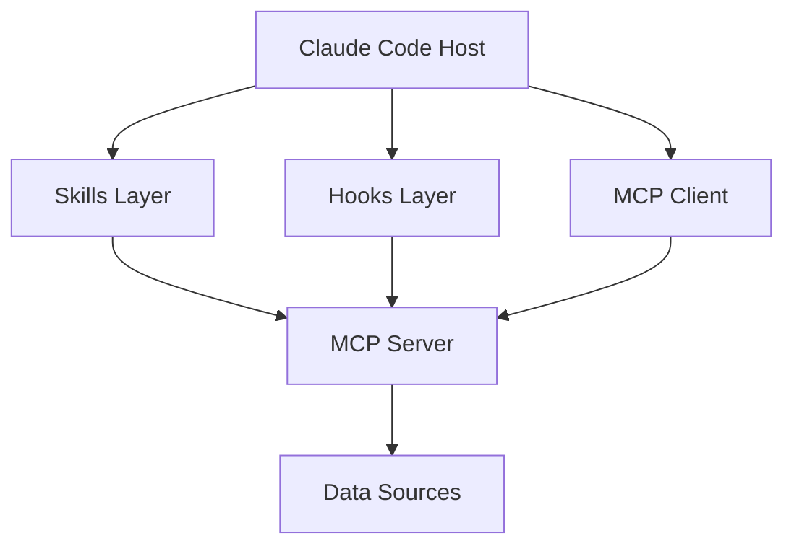

# kdev-code-graph 文档综合评审报告

> **评审者**: 灵码 (Lingma)  
> **评审日期**: 2026-04-28  
> **评审范围**: docs/skills/kdev-code-graph 目录下全部文档  
> **文档版本**: v1.0

---

## 一、评审概览

### 1.1 文档清单

| 文档 | 状态 | 质量评分 |
|------|------|----------|
| [README.md](README.md) | ✅ 结构清晰 | 8/10 |
| [2026-04-27-产品需求文档.md](2026-04-27-产品需求文档.md) | ✅ 内容完整 | 8.5/10 |
| [2026-04-27-架构设计方案.md](2026-04-27-架构设计方案.md) | ✅ 设计详尽 | 9/10 |
| [2026-04-28-调研报告.md](2026-04-28-调研报告.md) | ✅ 调研深入 | 9/10 |
| [2026-04-28-实施计划.md](2026-04-28-实施计划.md) | ✅ 计划合理 | 8/10 |
| [2026-04-28-评审方案.md](2026-04-28-评审方案.md) | ✅ 问题明确 | 8/10 |

### 1.2 总体评价

**优点**：
- ✅ 文档体系完整，覆盖从需求→调研→架构→实施→评审的全生命周期
- ✅ 技术调研深入，对 code-review-graph 和 graphify 两个参考项目分析透彻
- ✅ 复用策略明确，避免重复造轮子
- ✅ 数据模型设计合理，SQLite + WAL 模式选择恰当
- ✅ 风险评估全面，缓解措施可行

**待改进**：
- ⚠️ 部分文档存在内容重复，维护成本高
- ⚠️ 缺少明确的验收标准和测试策略
- ⚠️ 实施计划的优先级和里程碑需要细化
- ⚠️ 安全性和性能指标缺少量化验证方法

---

## 二、逐文档评审

### 2.1 README.md

#### 优点
- 文档索引清晰，方便快速定位
- 核心功能表格化展示，一目了然
- 插件状态表格直观反映当前进度

#### 改进建议

**1. 缺少快速开始指南**
```markdown
## 快速开始

```bash
# 安装插件
claude plugin install kdev-code-graph@kdev-agents

# 验证安装
/plugins validate ./kdev-code-graph
```
```

**2. 建议添加贡献指南链接**
建议在文档末尾添加：
- 如何参与开发
- 文档更新流程
- Issue 提交规范

**3. 状态表格建议增加时间预期**
| 维度 | 状态 | 预期完成时间 |
|------|------|--------------|
| MCP Server 实现 | 📝 待实施 | 2026-05-15 |
| Python 代码 | 📝 待实施 | 2026-05-30 |

---

### 2.2 产品需求文档 (PRD)

#### 优点
- 用户场景描述生动，流程清晰（场景 1/2/3）
- 功能清单优先级明确（P0/P1/P2）
- 非功能需求考虑全面（性能、安全、可用性）
- 风险分析表格完整

#### 改进建议

**1. 功能清单缺少验收标准**

当前问题：F1.1-F8.4 只有功能描述，没有"完成"的定义。

建议补充：
```markdown
#### F1.1 多语言 AST 解析

| 属性 | 值 |
|------|-----|
| 验收标准 | 30+ 语言解析成功率 >= 95% |
| 测试用例 | references/ 目录下 5 个样例项目通过 |
| 性能指标 | 单文件解析 < 100ms |
```

**2. 里程碑计划缺少关键路径**

当前 9 周计划是线性排列，但实际开发中有依赖关系：
- M2 依赖 M1 完成
- M3 可与 M2 并行
- M4 依赖 M3 的语义关联框架

建议绘制甘特图或依赖关系图：
```
M1: [████████] 周 1-2
M2:         [████████] 周 3-4 (依赖 M1)
M3:         [████] 周 3 (可并行)
M4:                 [████████] 周 5-6 (依赖 M3)
M5:                         [████] 周 7
M6:                             [████] 周 8-9
```

**3. 成功指标缺少测量方法**

| 指标 | 目标值 | 测量方法 |
|------|--------|----------|
| Token 减少率 | >=6.8× | 对比全文件扫描的 token 消耗 |
| 需求追溯准确率 | >=80% | 人工标注 100 个样本计算准确率 |
| 爆炸半径覆盖率 | >=95% | 注入已知变更验证检测率 |

**4. 缺少向后兼容性承诺**

建议添加：
```markdown
### 6.4 兼容性约束

| 约束 | 说明 |
|------|------|
| 数据库迁移 | SQLite schema 变更需提供迁移脚本 |
| API 版本 | MCP Tools 接口保持向后兼容 2 个版本 |
| 降级策略 | LLM API 不可用时降级为本地 regex 匹配 |
```

---

### 2.3 架构设计方案

#### 优点
- 架构图清晰（整体架构 + 数据流架构）
- 模块职责明确（Parser/KDevSec/Graph 三层）
- 配置文件示例完整（plugin.json/.mcp.json/hooks.json）
- 扩展性设计考虑周到（新格式支持接口）

#### 改进建议

**1. 架构图文档化**

当前架构图使用 ASCII art，建议：
- 导出为 PNG/SVG 嵌入文档
- 或使用 Mermaid 语法（支持 GitLab/GitHub 渲染）



**2. 模块交互缺少错误处理流程**

建议补充异常处理架构：
```
正常流程: Parser → KDevSec → Graph → Tools
异常处理:
  - Parser 失败 → 返回空节点列表，记录日志
  - LLM API 超时 → 降级为本地 regex 匹配
  - SQLite 锁冲突 → 重试 3 次，指数退避
```

**3. 性能优化策略缺少量化指标**

当前只提到"增量解析"、"缓存机制"，建议补充：
| 策略 | 预期效果 | 验证方法 |
|------|----------|----------|
| 增量解析 | 更新时间 < 2秒 | Git diff 5 个文件测试 |
| LLM 结果缓存 | API 调用减少 50% | 重复查询 10 次统计命中率 |
| 批量处理 | 解析速度提升 3× | 100 文件并发解析基准测试 |

**4. 安全设计需要补充**

建议添加：
```markdown
### 12.3 数据安全

| 数据类型 | 存储位置 | 加密方式 | 访问控制 |
|----------|----------|----------|----------|
| SQLite 数据库 | 本地 .kdev-code-graph/ | 文件系统权限 | 仅当前用户 |
| LLM API Key | 环境变量 | - | 不写入日志 |
| 图片缓存 | 临时目录 | 会话结束清理 | 自动删除 |
```

**5. 文档版本不一致**

问题：
- PRD 版本：v1.0.0（2026-04-27）
- 架构设计方案：无版本号
- 调研报告：无版本号

建议统一在文档头部添加：
```markdown
> **文档版本**: v1.0.0  
> **创建日期**: 2026-04-27  
> **最后更新**: 2026-04-28  
> **关联文档**: PRD v1.0.0, 调研报告 v1.0.0
```

---

### 2.4 调研报告

#### 优点
- 对两个参考项目分析深入，代码示例丰富
- 复用策略明确（必须复用/需扩展/可借鉴）
- 目录结构对比清晰

#### 改进建议

**1. 许可证兼容性已确认 ✅**

经核实，两个参考项目均为 MIT License：

| 项目 | 许可证 | 兼容性 | 风险 |
|------|--------|--------|------|
| code-review-graph | **MIT License** | ✅ 完全兼容 | 无风险，可自由依赖和复用 |
| graphify | **MIT License** | ✅ 完全兼容 | 无风险，可自由依赖和复用 |
| kdev-code-graph | 建议 MIT | ✅ 一致 | 与上游保持一致 |

**结论**：许可证问题已解决，P0-1 降级为 P2（建议在 pyproject.toml 中声明 MIT License）。

**2. 缺少性能对比数据**

建议补充两个参考项目的性能基准：
| 项目 | 构建时间 (500 文件) | 查询延迟 | 内存占用 |
|------|---------------------|----------|----------|
| code-review-graph | < 10秒 | < 100ms | < 100MB |
| graphify | < 15秒 | < 200ms | < 150MB |
| kdev-code-graph (目标) | < 10秒 | < 500ms | < 200MB |

**3. 可复用设计模式总结缺少代码示例**

建议在 3.1 必须复用部分添加：
```python
# 示例：如何复用 GraphStore
from code_review_graph.graph import GraphStore

class KDevSecGraphStore(GraphStore):
    def upsert_doc_node(self, doc: DocNode) -> int:
        # 实现代码...
        pass
```

**4. 缺少技术债务分析**

建议补充：
```markdown
## 七、技术债务风险

| 风险 | 描述 | 缓解措施 |
|------|------|----------|
| 上游依赖更新 | code-review-graph API 变化 | 锁定版本，编写适配器层 |
| Schema 迁移 | nodes/edges 表结构变更 | 提供 migration 脚本 |
| LLM API 版本 | Claude Sonnet 4.6 停服 | 支持多模型切换 |
```

---

### 2.5 实施计划

#### 优点
- Phase 划分合理（基础→文档→爆炸半径→图片）
- 代码示例清晰，方便直接参考实现
- 目录结构规划完整

#### 改进建议

**1. Phase 1 缺少明确的 Definition of Done (DoD)**

建议补充：
```markdown
### Phase 1 完成标准

- [ ] pyproject.toml 通过 `pip install -e .` 安装
- [ ] server.py 响应 `build_graph` 工具调用
- [ ] KDevSec_query 返回至少 1 个关联节点
- [ ] 单元测试覆盖率 >= 80%
- [ ] 端到端测试通过 (build_graph → KDevSec_query)
```

**2. 缺少人力资源分配**

建议添加：
| Phase | 负责人 | 工作量 (人日) | 依赖 |
|-------|--------|---------------|------|
| Phase 1 | 待定 | 5 天 | 无 |
| Phase 2 | 待定 | 3 天 | Phase 1 |
| Phase 3 | 待定 | 2 天 | Phase 1 |
| Phase 4 | 待定 | 4 天 | Phase 2 |

**3. 实施计划与 PRD 里程碑不一致**

问题：
- PRD 里程碑：M1-M6 共 9 周
- 实施计划：Phase 1-4，无时间估算

建议统一时间线：
| 实施计划 | PRD 里程碑 | 时间 |
|----------|------------|------|
| Phase 1 | M1: 核心框架 | 周 1-2 |
| Phase 2 | M2-M3: 代码+文档解析 | 周 3-4 |
| Phase 3 | M2: 爆炸半径 | 周 3 (并行) |
| Phase 4 | M4: 图片解析 | 周 5-6 |

**4. 缺少回滚策略**

建议补充：
```markdown
## 风险缓解

### 回滚策略

| 场景 | 回滚方案 |
|------|----------|
| Phase 1 验证失败 | 降级为纯 code-review-graph，暂不扩展 |
| LLM API 不可用 | 禁用语义关联，仅保留代码解析 |
| 性能不达标 | 关闭图片解析，限制图谱规模 |
```

**5. 下一步行动缺少优先级**

当前 5 个行动项是平铺的，建议标注优先级：
1. **创建 pyproject.toml** - 🔴 P0 (阻塞后续)
2. **实现 server.py** - 🔴 P0 (核心入口)
3. **实现 store.py** - 🟡 P1 (可并行)
4. **实现 md_parser.py** - 🟡 P1 (依赖 Phase 1)
5. **验证端到端** - 🟢 P2 (验证阶段)

---

### 2.6 评审方案

#### 优点
- 评审问题清单清晰（Q1-Q5）
- 关键设计决策标注明确
- 参考项目对比表格直观

#### 改进建议

**1. 评审方案与实施计划重复度高**

问题：评审方案中 70% 内容（技术选型、复用策略、Schema 设计、Phase 划分）与实施计划和架构设计方案重复。

建议重构评审方案为：
```markdown
# 评审聚焦问题

## 一、决策待确认事项 (3 个)
1. 直接依赖 code-review-graph 是否可行？
2. Schema 通过 extra JSON 扩展是否合理？
3. Phase 4 图片解析是否延迟到 v1.1？

## 二、风险待评估事项 (2 个)
1. LLM API 成本是否可控？
2. 语义关联准确率如何验证？

## 三、评审会议议程
- 15 分钟：方案概述
- 20 分钟：决策事项讨论
- 10 分钟：风险评估
- 5 分钟：下一步行动
```

**2. 评审问题缺少责任人**

建议补充：
| 评审问题 | 决策人 | 截止日期 | 状态 |
|----------|--------|----------|------|
| Q1: 技术选型 | 技术 Leader | 2026-04-30 | 待决策 |
| Q2: Schema 设计 | 架构师 | 2026-04-30 | 待决策 |

**3. 缺少评审通过标准**

建议添加：
```markdown
## 评审通过标准

- [ ] 所有 P0 评审问题已解决
- [ ] 技术选型已确认，无阻塞项
- [ ] 实施计划时间线已对齐
- [ ] 风险缓解措施已落实
- [ ] 至少 2 名评审者签字确认
```

---

## 三、跨文档问题

### 3.1 内容重复问题

| 重复内容 | 涉及文档 | 建议 |
|----------|----------|------|
| 复用策略 | 调研报告、实施计划、评审方案、架构设计 | 只在调研报告详细说明，其他文档引用 |
| Schema 设计 | PRD、架构设计、评审方案 | 只在架构设计详细说明，其他引用 |
| Phase 划分 | 实施计划、评审方案 | 合并为一个文档 |

**建议**：建立文档引用机制
```markdown
<!-- 在评审方案中 -->
详见 [2026-04-28-调研报告.md](2026-04-28-调研报告.md) 第 4 节"实施策略更新"
```

### 3.2 术语不一致问题

| 术语 | 文档 1 | 文档 2 | 建议统一为 |
|------|--------|--------|------------|
| 插件名 | kdev-code-graph | KDevSec Code Graph | kdev-code-graph (对外称 KDevSec Code Graph) |
| 置信度 | confidence_score | confidence | confidence |
| 信心分级 | EXTRACTED/INFERRED/AMBIGUOUS | confidence_tier | confidence_tier |
| 图存储 | SQLite 图存储 | GraphStore | GraphStore (SQLite 实现) |

### 3.3 缺少变更日志

建议在所有文档头部添加版本历史：
```markdown
## 版本历史

| 版本 | 日期 | 变更内容 | 作者 |
|------|------|----------|------|
| v1.0.0 | 2026-04-27 | 初始版本 | - |
| v1.1.0 | 2026-04-28 | 补充调研报告 | - |
```

---

## 四、优先级改进建议

### 🔴 P0 - 必须修改（阻塞实施）

| 编号 | 问题 | 影响 | 建议方案 |
|------|------|------|----------|
| P0-1 | 缺少许可证兼容性分析 | 可能导致法律风险 | 立即确认 code-review-graph 和 graphify 的许可证 |
| P0-2 | Phase 1 缺少 DoD | 无法判断完成标准 | 补充验收清单和测试策略 |
| P0-3 | 实施计划与 PRD 时间线不一致 | 项目管理混乱 | 统一里程碑和实施计划的时间估算 |

### 🟡 P1 - 建议修改（影响质量）

| 编号 | 问题 | 影响 | 建议方案 |
|------|------|------|----------|
| P1-1 | 功能清单缺少验收标准 | 测试覆盖不完整 | 为 F1.1-F8.4 补充验收标准 |
| P1-2 | 文档内容重复度高 | 维护成本高 | 建立文档引用机制，消除重复 |
| P1-3 | 术语不一致 | 理解成本高 | 统一术语表，更新所有文档 |
| P1-4 | 缺少回滚策略 | 实施风险高 | 补充降级和回滚方案 |

### 🟢 P2 - 优化建议（提升体验）

| 编号 | 问题 | 影响 | 建议方案 |
|------|------|------|----------|
| P2-1 | README 缺少快速开始 | 新用户上手慢 | 补充安装和验证步骤 |
| P2-2 | 架构图使用 ASCII | 可读性差 | 导出为 Mermaid 或图片 |
| P2-3 | 缺少变更日志 | 版本追踪困难 | 添加版本历史表格 |
| P2-4 | 评审方案过于冗长 | 评审效率低 | 精简为决策事项清单 |

---

## 五、总体建议

### 5.1 文档结构优化

建议重构为以下结构：

```
docs/skills/kdev-code-graph/
├── README.md                    # 项目概览 + 快速开始
├── 01-产品需求文档.md            # PRD（功能需求 + 用户场景）
├── 02-调研报告.md               # 技术调研 + 复用策略 + 许可证分析
├── 03-架构设计方案.md            # 模块设计 + 数据模型 + Schema
├── 04-实施计划.md               # Phase 划分 + 时间线 + DoD
├── 05-测试策略.md               # 新增：单元测试 + 集成测试 + 验收标准
└── 06-术语表.md                 # 新增：统一术语定义
```

### 5.2 下一步行动

1. **确认许可证兼容性** (P0-1) - 负责人：___，截止：2026-04-30
2. **补充 Phase 1 DoD** (P0-2) - 负责人：___，截止：2026-04-30
3. **统一时间线** (P0-3) - 负责人：___，截止：2026-04-30
4. **消除文档重复** (P1-2) - 负责人：___，截止：2026-05-05
5. **补充测试策略文档** (P1-1) - 负责人：___，截止：2026-05-05

### 5.3 评审结论

| 维度 | 结论 | 说明 |
|------|------|------|
| 需求完整性 | ✅ 通过 | PRD 覆盖核心功能，需补充验收标准 |
| 技术可行性 | ✅ 通过 | 复用策略合理，技术选型成熟 |
| 实施计划 | ⚠️ 有条件通过 | 需补充 DoD 和时间线对齐 |
| 风险评估 | ✅ 通过 | 风险识别全面，缓解措施可行 |
| 文档质量 | ⚠️ 需改进 | 存在重复和术语不一致问题 |

**总体结论**：✅ **有条件通过评审**，需在实施前完成 P0 改进项。

---

## 六、附录

### 6.1 术语表（建议）

| 术语 | 英文 | 说明 |
|------|------|------|
| 知识图谱 | Knowledge Graph | 代码和文档的语义关联网络 |
| 爆炸半径 | Blast Radius | 代码变更的影响范围 |
| 信心评分 | Confidence Score | 语义关联的可信度 (0.0-1.0) |
| 信心分级 | Confidence Tier | EXTRACTED/INFERRED/AMBIGUOUS |
| 语义关联 | KDevSec Link | LLM 推断的 doc-code 关联 |
| GraphStore | GraphStore | SQLite 实现的图存储层 |

### 6.2 参考文档

| 文档 | 路径 |
|------|------|
| code-review-graph | references/code-review-graph/ |
| graphify | references/graphify/ |
| Claude Code Plugin 文档 | https://docs.anthropic.com/claude-code/plugins |

---

**评审完成**  
**下次评审日期**: 2026-05-05 (Phase 1 完成后)
