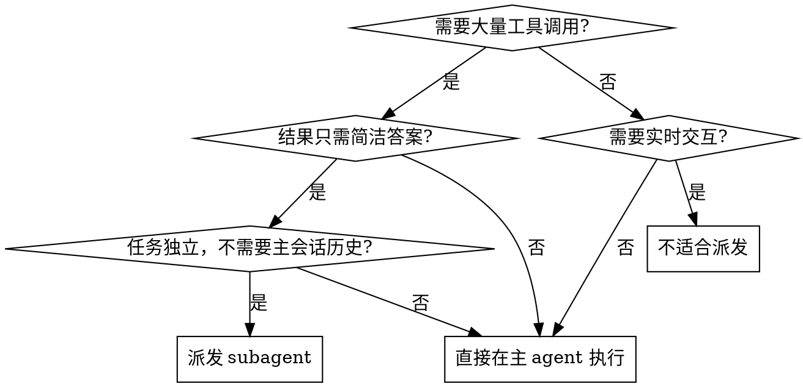

# KDev Explorer

## 概述

派发一个独立的 subagent 执行任务，主会话保持轻量。Subagent 完成后返回简洁结论，不占用主会话的上下文空间。

**核心价值：上下文隔离**
- 主 agent 不被大量工具调用结果膨胀
- Subagent 自己的探索过程不污染主会话历史
- 结果简洁，只返回你需要的答案

## 适用场景



**适用：**
- 网页抓取 + 总结（多个 WebFetch/MCP fetch）
- 文档目录探索（Glob + 多个 Read）
- 代码库查找（多次 Grep/Glob）
- 数据查询（多次 API 调用）
- 任何会产生大量工具调用结果的任务

**不适用：**
- 需要实时交互反馈（用户要看到过程）
- 任务依赖主会话历史（需要之前的对话上下文）
- 结果本身很长（大段代码、完整文档）
- 需要主 agent 中途介入调整

## Prompt 结构

好的 subagent prompt 包含四个要素：

### 1. Scope (范围)
明确任务边界，避免 subagent 范围蔓延。

```
**Scope:** D:\Works\SecDev\kdev-agents\docs\skills\kdev-code-graph
```

### 2. Task (任务步骤)
清晰的执行步骤，不要模糊指令。

```
**Task:**
1. List all markdown files using Glob
2. Read key documents (PRD, architecture, analysis)
3. Summarize each document's core theme
```

### 3. Constraints (约束)
防止 subagent 做不必要的工作。

```
**Do NOT:**
- Read every file exhaustively
- Include implementation details
- Generate new content
```

### 4. Output (输出格式)
规定返回格式，确保结果简洁有用。

```
**Return:**
- File list (bullet format)
- Document themes (table format)
- Overall purpose (1-2 sentences)
```

## Prompt 模板

### 探索文档目录

```markdown
Explore documentation directory:

**Scope:** {directory_path}

**Task:**
1. List all files using Glob `{pattern}`
2. Read key documents (prioritize: {document_types})
3. Summarize each document's core theme

**Do NOT:**
- Read every file - focus on key documents
- Include implementation details
- Duplicate known information

**Return:**
Structured summary with:
- File tree structure
- Document themes (filename + 1-2 sentences)
- Overall purpose of directory
```

### 网页抓取总结

```markdown
Fetch and summarize web content:

**Scope:** {url_list}

**Task:**
1. Fetch each URL using WebFetch or MCP fetch tool
2. Extract key information: {what_to_extract}
3. Compare/synthesize across sources if multiple URLs

**Do NOT:**
- Return raw HTML content
- Include all details - focus on {focus_area}
- Follow links beyond specified URLs

**Return:**
- Key findings per URL
- Synthesis/comparison if multiple sources
- Actionable recommendations (if applicable)
```

### 代码库探索

```markdown
Explore codebase for {target}:

**Scope:** {repository_path}

**Task:**
1. Search using Grep for pattern: {pattern}
2. Locate relevant files using Glob: {glob_pattern}
3. Read key files to understand {what_to_understand}

**Do NOT:**
- Read all matched files - prioritize by {priority_criteria}
- Refactor or modify code
- Run tests or build commands

**Return:**
- Relevant files list
- Key findings about {target}
- Recommended next steps (if applicable)
```

## Subagent 类型选择

| 任务类型 | 推荐 subagent_type |
|----------|-------------------|
| 代码/文档探索 | `Explore` |
| 网页抓取 | `general-purpose` |
| 复杂研究任务 | `general-purpose` |
| 简单查找 | 主 agent 直接用 Grep/Glob |

## 执行流程

```
主 agent:
  1. 判断任务是否适合派发
  2. 构造结构化 prompt
  3. 调用 Agent 工具派发
  4. 等待返回 (不做其他操作)
  5. 收到结果 → 展示给用户

Subagent:
  1. 收到 prompt → 理解任务
  2. 执行工具调用 (Glob/Read/Fetch等)
  3. 整理结果
  4. 返回简洁答案
```

## 与 dispatching-parallel-agents 的区别

| Skill | 定位 | 适用场景 |
|-------|------|----------|
| kdev-explorer | 单个独立任务，释放上下文 | 网页抓取、文档探索、代码查找 |
| dispatching-parallel-agents | 多个独立问题并行处理 | 3+ test failures, 多子系统故障 |

**组合使用：** 如果有多个独立探索任务，可以先用 kdev-explorer 的 prompt 结构，再通过 dispatching-parallel-agents 并行派发。

## 最佳实践

1. **Prompt 要具体** — "探索文档" 太模糊，"探索 PRD/架构/调研文档" 更清晰
2. **约束要明确** — Do NOT 比正面指令更有效防止范围蔓延
3. **输出要简洁** — 规定格式确保结果有用且不膨胀主会话
4. **Subagent 类型匹配** — Explore 用于代码/文档，general-purpose 用于网页/研究
5. **任务要独立** — 不依赖主会话历史的任务才适合派发

## 常见错误

| 错误 | 正确做法 |
|------|----------|
| "去看看那个项目" | "探索 {path} 的 {target} 文件，总结 {aspect}" |
| "随便找找" | "用 Grep 搜索 {pattern}，返回前 5 个匹配的文件路径" |
| 没有约束 | 添加 Do NOT 防止过度探索 |
| 没有输出格式 | 规定 Return 格式确保结果可用 |