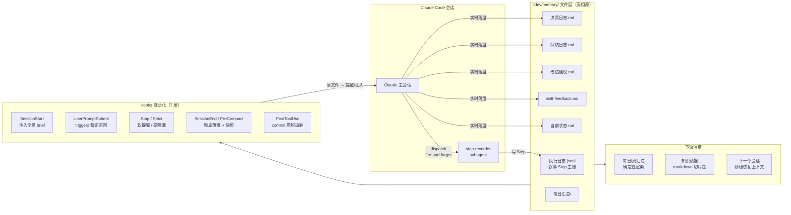

# kdev-memory 工程记忆：让 AI 协作不再失忆

> 技术分享文档 · 基于 kdev-memory **v0.19.8**（2026-07-08）
> 面向读者：已在使用 Claude Code 的同事

**一句话介绍**：kdev-memory 是一个 Claude Code 插件，让 Claude 在项目推进过程中把关键信号（做了什么、踩了什么坑、拍了什么板、你当时怎么评价）**实时落盘**到项目的 `.kdev/memory/` 目录；新会话自动读回、提到相关话题自动召回——解决长周期项目"每次新会话重新解释上下文、上周的坑这周再踩、决策理由无从查起"的失忆问题。

**阅读指引**：正文只有两章——**第 1 章装起来，第 2 章用起来**，读完即可上手。想了解设计动机、整体架构、机制原理、进阶话题的，按需翻附录 A–E。

---

## 1. 安装与初始化

### 1.1 安装插件

kdev-memory 走 Claude Code 插件市场安装（kdev-agents 仓库即插件市场）：

```
/plugin marketplace add <kdev-agents 仓库地址>
/plugin install kdev-memory@kdev-agents
```

装完重启会话生效。

> ⚠️ 后续插件升级后要**刷新 marketplace 再重启**——hook / agent 有本地缓存，不刷新升级不生效。这本身就是本项目踩过并被记忆机制记下来的坑（G-004）。

### 1.2 在项目里初始化：一句话的事

进入你的项目，对 Claude 说：

> "给这个项目建立工程记忆"

Claude 会自动完成三件事：

1. 在项目根建 `.kdev/memory/` 目录 + 七类骨架文件（各文件干什么见附录 B.2）；
2. 在项目 CLAUDE.md 写入触发规则段（3 条铁规 + 召唤时机，原理见附录 C）；
3. 写入显式授权：`.kdev/memory/` 下的写入**不需要逐条请示**——这是制度，不是每次都要审批的一次性操作。

初始化基本零决策——记录 ID 已默认时间戳形（并发不撞号，见附录 D.1），无需纠结编号策略。

### 1.3 验证接入成功

新开一个会话。如果开头能看到 `<kdev-memory-brief>` 注入（今日进度 + 项目状态 + 待处理项的全景摘要），说明 SessionStart hook 已生效，接入完成。

### 1.4 记忆仓 git 托管（可选但强烈推荐）

`.kdev/` 可以作为**独立 git 仓**（nested repo，与代码仓分开）托管，好处：

- 换机 / 重装不丢记忆；
- 团队成员之间可以同步共享同一份项目记忆；
- 记录本身有版本历史，可追溯。

对 Claude 说"把工程记忆建成独立记忆仓"即可。不想要这个功能，在项目根 `ieidev-sync.yml` 写一行 `sync: off` 就永久静默。

### 1.5 什么项目不适合用

诚实地说，不是所有项目都需要：

- **一次性脚本、单会话就结束的任务**——过度设计，别用；
- **已有 Jira / Linear 承接决策和缺陷**——可以退化成只保留执行日志 + 每日汇总；
- **你明确说"别搞那么多文件"**——Claude 会听你的，可以退化成只有执行日志一份。

判断标准就一条：**这个项目会不会跨多个会话、需不需要"下次接着干"**。

---

## 2. 如何使用

> 本章是分享的核心：怎么用（§2.1）、忘了怎么办（§2.2）、记了能干什么（§2.3）、本仓真实效果（§2.4）、别怎么用（§2.5）。

### 2.1 你其实只需要会说这几句话

日常使用的心智负担被刻意压到最低——绝大多数记录**自动发生**，你只在少数场景开口。按"你说什么 → 发生什么"组织：

#### 什么都不说：Step 自动落盘

Claude 每做完一个工作单元（判据：有 commit 的独立任务 / 一个决策拍板 / 一个坑被解决 / 你给了评分），会自动 dispatch 一个 step-recorder subagent 把 Step 写进 `执行日志.jsonl`。**fire-and-forget**——主会话写一段 30 行的 YAML 摘要就继续干活，不等落盘完成、不打断你的对话流。

Step 长这样（四段结构，设计原理见附录 C.4）：

- **执行事实**：工具调用次数 / 报错次数 / 绕路次数 / token 消耗感 / 用了哪些 skill
- **模型自评**：顺畅度 1–5 分，**必须写一条扣分项**（防讨好式满分）
- **用户评分**：默认 `user-opt-in` 模式——公布自评后轻提一句，你不回应就留空，不追问
- **评分差异分析**：两边都有分且差值 ≥ 2 时生成，并自动开一条改进建议

#### "今天做到哪了 / 继续昨天的"

新会话恢复上下文的标准姿势。Claude 从 `每日汇总/` + `当前状态.md` 回读，**不需要你复述任何背景**。当前状态.md 的 frontmatter 记着 `current_step` / `pending_decisions` / `unresolved_gotchas`，是机读的单一真相源。

#### "写今天的总结"

触发每日汇总。重点：Claude 的动作路径是**跑确定性渲染脚本从文件聚合**（`daily_render.py` 秒级出全五段骨架：完成的工作 / 未完成项 / 明日计划 / 当日新增决策与踩坑索引 / 负面评价观察），而**不是**回翻会话上下文、更不是让你口述今天干了啥。

如果当天文件里没记录，Claude 会坦率报告"今天实时落盘没跟上"——**宁可承认断档，不凭印象编造**。这是数据诚信（原理见附录 C.2）。

#### "这个坑记一下"

落一条 G 条目到踩坑日志，带 3–5 个 `triggers` 关键词（中英文都有）。关键词是**智能召回的锚点**：下次任何会话里你的提问命中这些词，UserPromptSubmit hook 就注入一个 ~30 token 的指针（编号 + 标题 + 路径），Claude 判断相关再去读全文——渐进式披露，召回不炸上下文（原理见附录 C.7）。

实际上多数坑不用你开口——Claude 踩到坑（报错、绕路、命令失败）会主动记。

#### "这事别替我拍板，问我"

有歧义、多选项、不可逆的事项走 Q 决策条目：记录**选项、你的选择、以及理由**。记理由是关键——未来 review 时看的不是结论，是当时的取舍逻辑。

#### 顺手吐槽外部工具

你在对话里对某个 skill / 插件 / 工具说出这五类话——**想要新功能（RFE）/ 痛点 / bug / 表扬 / 困惑**——Claude 会识别出来，一句话跟你确认后落一条 F 反馈：

> 你："这个 XX 插件每次都弹三行提示，太吵了。"
> Claude："这条记为对 plugin:XX 的痛点反馈？" → 确认后落盘，**你的原话逐字保留**。

`verbatim`（原话）字段不可改写是铁规——原话保留了情绪、强度、具体场景，蒸馏价值远高于任何转述（原理见附录 C.6）。

#### 打分时夹带吐槽：自动裂解

> 你："这步 4 分，但那个测试工具太难用了。"

Claude 会自动**评分裂解**成两条：Step 评分段记项目分 4 分（subject: project），F 条目记对测试工具的痛点（subject: tool:XX，原话保留）。评的是谁（subject）由 Claude 三级推断自动确定，**不会让你填表**（原理见附录 C.5）。

#### 评分模式一句话切换

不想被问评分？说"关掉评分"→ 切到 `model-only`（模型只写自评，不打扰你）。想严格把关？说"严格评分"→ `user-required`（不给分不算 Step 完成）。默认 `user-opt-in` 居中。

### 2.2 自动化兜底：忘了也不怕

实时落盘依赖 Claude 的自觉，而 LLM 被任务流吸住时**遗忘是常态**（本项目早期实测过 75% 的漏记率——这个数字本身就记录在改进建议里）。所以插件配了 7 层 hooks 兜底：

| Hook | 时机 | 干什么 |
|---|---|---|
| **SessionStart** | 会话启动 | 注入 `<kdev-memory-brief>` 全景（今日进度 / 项目状态 / ⚠️ 待处理项 / CLAUDE.md 接口漂移检测） |
| **UserPromptSubmit** | 你每次发消息 | 字面匹配 triggers → 注入 `<kdev-memory-recall>` 召回指针（session 内去重） |
| **PostToolUse** | 每次 git commit | 累积 pending-commits，漏 dispatch 时 brief 里显示"N 个 commit 待记录" |
| **Stop** | 每轮回复结束 | 软提醒：漏汇总 / 漏 Step / 该归档了 |
| **Strict**（opt-in） | 同上 | `touch .kdev/memory/strict` 开启：漏记直接硬阻塞（exit 2），适合制度磨合期 |
| **PreCompact** | 上下文压缩前 | 快照到 `checkpoints/`（7 天自动清理）+ 兜底落降级 Step |
| **SessionEnd** | 会话关闭 | 当天没有合格 Step 但工作区有变更 → **机械落一条降级 Step** + 写 `WARN-未记录-*.md` 兜底文件 |

**v0.19.6–0.19.8 的"三层防线"值得单独一提**：即使主会话彻底忘了 dispatch，SessionEnd / PreCompact（两个"LLM 缺席的丢失关口"）会**机械落一条 auto-fallback 降级 Step**——没有 LLM 提炼、但至少 commit 清单和变更事实不丢；下个会话 SessionStart 提示"有降级 Step 待升格"，Claude 再异步补全叙事。设计哲学：**从"忘了就丢"变成"机械保底不丢 + 事后升格"**（细节见附录 D.5）。

设计边界要讲清楚：**hook 只能"戳一下"或"罢工阻塞"，不能做智能判断**。该不该写、写什么、subject 是谁——这些判断归 skill 和 Claude。想用 hook 替代 skill 做智能决策是反模式。

### 2.3 下游消费：记了这么多，能干什么

#### 交接班：每日 / 每周汇总

- 每日汇总：§2.1 讲过，确定性脚本聚合，秒级生成；
- 周总结：`/kdev-memory-weekly` 生成滚动 7 天汇总，按"过程资产 / 经验总结 / 问题教训 / 开发进展"四段组织——直接可以当周报底稿。

#### 知识蒸馏：`/kdev-memory-distill`

把积累的记录 filter + 脱敏后导出三个 markdown 切片包：

| 切片包 | 内容 | 用途 |
|---|---|---|
| `dataset-full/` | 全量记录（Step / Q / G / R / F） | 通用蒸馏原料 |
| `dataset-misalignment/` | 模型自评 vs 用户评分差值 ≥ 2 的样本 | 对齐 / RLHF 信号 |
| `dataset-skill-feedback-by-subject/` | F 条目按 subject 路由 | 定向反哺各 skill 的维护方 |

蒸馏还有**自动触发**：距上次 ≥ 7 天且数据增量到阈值 → SessionStart 后台自动跑 dataset 阶段。但 **promote（挑选沉淀进 docs/）永远人工**——高风险动作不自动化。

#### 反哺项目：规则升级

同主题改进建议出现 ≥ 2 次、或你明确说"这条升级成铁规"→ 走规则升级流程（必问三件事，绝不替你拍板）→ 沉淀进方法论铁规 / CLAUDE.md / ADR。整条链路是：**原始信号 → 人工确认 → 项目规则**，记录永远不自动变成强制。

### 2.4 真实效果：本仓库自己的账本

kdev-agents 仓库自己吃自己的狗粮（self-hosting），从 2026-05-24 初始化至今 **46 天**的真实数据：

| 记录类型 | 条数 | 说明 |
|---|---|---|
| Step | **120** | 116 条历史 md（冻结）+ jsonl 主账持续追加 |
| Q 决策 | **25** | 从"Step 编号全局还是迭代内递增"到"JSONL 主账迁移"全有底账 |
| G 踩坑 | **13** | 含 triggers，可被自动召回 |
| R 改进建议 | **8** | 其中多条已走升级流程变成项目铁规 |
| F skill 反馈 | **1** | 对外部工具的原话反馈 |

几个真实片段感受一下：

- **踩坑召回救场**：G-004"插件改 hook 必须 bump version + 刷新 marketplace 否则 cache stale"——这个坑记录后，之后每次发版会话里只要提到"hook 不生效"，召回指针立刻弹出来，同一个坑没有第二次花时间排查。
- **决策底账**：为什么叙事 Step 迁 JSONL 但历史 md 不迁、永久 dual-read？决策日志里有完整的选项对比和拍板理由（Q 20260625-173847），两周后 review 架构时直接翻到。
- **兜底防线真实工作中**：本仓 `.kdev/memory/` 里现在就躺着几个 `WARN-未记录-*.md`——那几天主会话确实忘了落盘，SessionEnd 兜底把快照留住了，等人工核对补记。**机制不完美，但断档可见、可补，而不是无声消失。**
- **机制自身的进化闭环**：0.19.8 修的"模型他评静默降级"bug，最初就是作为一条 G 踩坑记录进账本的（"死了 3 周才发现"），从发现、根因到修复全程有迹可查。

### 2.5 最佳实践与反模式

**✅ 建议这么做**

- **triggers 用"你会说的口语词"**：命令名、场景词、特征词，中英文都写。写得太泛（"error"）召回全是噪音，太特殊（具体错误码）永远不命中。
- **原始胜于提炼**：改进建议是原料库不是结论库。保留原话、事实、具体数字——未来看原始证据比看当时的总结有价值。
- **编号不回收、搬家不删除**：条目废弃标"已废"，切档归档时全文搬走留索引。编号稳定性 > 紧凑性。
- **先立骨架再谈规则**：初始化时别急着塞一堆"约定"，约定应该从真实踩坑里长出来。
- **磨合期开 strict 模式**：制度刚落地时用硬阻塞逼出习惯，跑顺后关掉。

**❌ 别这么做**

- **事后补写评分**：过夜补录的分数严重失真（感受褪色）。宁可标"待补"。
- **把模型自评拷进用户评分段**：这是伪造用户数据，直接污染下游 misalignment 数据集。
- **汇总时回翻会话**："文件里没有就翻会话补"是机制失效的信号，应该坦率报告断档，而不是绕过文件层。
- **用 hook 做智能判断**：hook 是闹钟不是大脑。
- **记了几条改进建议就回头强改本项目方法论**：记录归记录，执行归执行。除非用户明确说"升级成铁规"。

---

# 附录

> 以下内容不影响上手使用，按需阅读：
> **A** 为什么需要工程记忆（设计动机）· **B** 全景图（整体架构与七类记录）· **C** 核心机制拆解（原理）· **D** 进阶话题 · **E** Q&A 与资源

## 附录 A：为什么需要工程记忆（设计动机）

### A.1 三个熟悉的失忆场景

用 Claude Code 做长周期项目（跨天、跨周、多迭代）的同事，大概率都遇到过：

1. **每次新会话都要重新解释上下文**——"我们这个项目是做 X 的，上次做到 Y，接下来要做 Z……"，一段开场白讲了几十遍。
2. **上周踩过的坑这周又踩**——某个命令的参数陷阱、某个依赖的隐藏行为，上个会话里 Claude 绕了半小时弯路才搞明白，这个会话它一无所知，原样再绕一遍。
3. **"上次为什么选 A 不选 B"无从查起**——两周前拍板的技术选型，当时的备选项和取舍理由只存在于那个早已关闭的会话里。想 review 决策？没有底账。

### A.2 根因：会话上下文不是持久存储

这三个场景的根因是同一个——**会话上下文是易失的**：

- 会话关闭即消失，跨会话不可见；
- 会话太长会被**自动压缩**，压缩就是有损截断，细节先丢；
- 会话可能崩溃，崩溃时未固化的信息全部蒸发。

把项目的关键信号（做了什么、踩了什么坑、拍了什么板、用户当时怎么评价）寄存在会话上下文里，等于把账本写在沙滩上。

### A.3 核心思路一句话

**把关键信号在发生的当下实时落盘成文件——文件才是跨会话的真相源。**

### A.4 第二层价值：给未来的 skill 作者留一手原料

除了跨会话续航，这套记录还有一个更长线的定位：**真实的评分、踩坑轨迹、用户反馈原话，是未来改进 skill / 做知识蒸馏的一手原料**。

- 模型自评 3 分、用户实际给 5 分——这个差值本身就是有价值的对齐信号；
- 用户随口一句"这个工具太吵了"，原话保留下来，比任何事后总结都更接近真实需求；
- 踩坑的完整轨迹（现象 → 排查 → 根因 → 解法）是天然的教学样本。

这一层不要求项目强制执行什么，只要求**如实捕获**。记录和执行是两件事。

## 附录 B：全景图——整体架构与七类记录

### B.1 架构一图流



读这张图记住三件事：

1. **文件层是中心**——Claude 写它，hooks 读它，下游消费它。会话可以死，文件不会。
2. **写入是实时的**——不是会话结束时回忆补写（那样早丢了、也失真了）。
3. **hooks 只做"戳一下"**——真正决定"该不该写、写什么"的智能判断在 skill 和 Claude 手里，hooks 负责提醒、注入、兜底。

### B.2 `.kdev/memory/` 七类记录各管什么

| 文件 | 记什么 | 什么时候写 |
|---|---|---|
| **执行日志.jsonl** | 叙事 Step（最核心）：每个工作单元四段——执行事实 / 模型自评 / 用户评分 / 差异分析 | 每完成一个工作单元 |
| **决策日志.md**（Q） | 需要人拍板的事：选项 + 用户选择 + **理由** | 有歧义 / 多选项 / 不可逆时 |
| **踩坑日志.md**（G） | 绕了弯才发现的事，带 `triggers` 关键词供自动召回 | 踩坑 / 报错 / 命令失败时 |
| **改进建议.md**（R） | 项目内方法论反思的**原始信号**（不提炼不过滤） | 评分差值 ≥ 2 / 反复出现的负面信号 |
| **skill-feedback.md**（F） | 对**外部** skill / 插件 / 工具的反馈，用户**原话**不可改写 | 用户对工具表达 RFE / 痛点 / bug / 表扬 / 困惑时 |
| **当前状态.md** | 工作状态单一真相源（含 YAML frontmatter 供 hook 机读） | 每完成 Step 顺手更新 |
| **每日汇总/** | 给下次会话的交接班文档 | 用户说"写今天总结"时从文件聚合生成 |

> 另有可选的 `方法论铁规.md`（项目自愿立的硬规则）。记录 ID 自 v0.17 起用时间戳形（如 `Step 20260707-113141-ly`），多会话并发也不撞号（附录 D.1）。

### B.3 三层触发机制

| 层次 | 机制 | 你需要做什么 |
|---|---|---|
| **自然触发** | skill description 命中 | 说人话即可："建立工程记忆"、"写今天总结"、"继续昨天的" |
| **主动触发** | 初始化时写进项目 CLAUDE.md 的规则段 | 无——每个新会话 Claude 读到规则自动照做 |
| **自动触发** | 插件自带的 7 层 hooks | 无——忘了也有兜底（§2.2） |

## 附录 C：核心机制拆解（懂原理才敢信任）

### C.1 铁规一：实时落盘，不是会话末尾回忆

**规则**：每做完一步、踩一次坑、做一次决策、收到一次评分，**立刻**写文件。这是持续的后台动作，不是攒到最后一次写完。

**为什么**：不实时落盘的三个后果——

1. 会话被压缩或崩溃 → 当天信号全失；
2. 记忆失真 → 靠回忆写的记录比实时写的差一个量级；
3. 评分过夜补录 → 分数严重失真。

这条规则**决定整个 skill 是否成立**：如果记录靠会话末尾回填，这套机制就退化成"结束前写点总结"——毫无价值。区别不在"有没有文件"，在"文件内容是否实时、准确、不偏向"。

### C.2 铁规二：汇总只读文件，不翻会话

**规则**：生成每日汇总时，动作路径是"跑确定性渲染脚本从 `.kdev/memory/` 聚合"，严禁回翻会话上下文、严禁让用户复述。

**为什么**：实时落盘阶段已经带着当下准确的细节写好了每一条，汇总只需筛选 + 拼装——快且准。反过来，"非要翻会话才能写出汇总"恰恰证明实时落盘没做到位，是机制失效的警报。所以宁可在汇总里标"待补（会话中未及时落盘）"，也不编造。

**实现**：`daily_render.py` 是承重墙——纯脚本 I/O + 拼装，不是 LLM 推理，秒级出五段骨架；LLM 润色只是可选叠加层，永不进关键路径。

### C.3 铁规三：优先处理 hook 产出

看到这四种信号，先处理再干别的：

- `WARN-未记录-*.md`：SessionEnd 兜底文件 → 读快照、向用户核对、补记、删除；
- `<kdev-memory-brief>`：会话全景，⚠️ 条目优先；
- `<kdev-memory-recall>`：召回指针，判断相关性、按需 Read；
- `checkpoints/压缩前-*.md`：压缩快照，按需读。

这三条铁规是唯一写进项目 CLAUDE.md 的内容（因为需要 Claude "时刻在场"地遵守）；其余细节都留在 skill 里，召唤时按需加载——避免 CLAUDE.md 与 skill 演进漂移。

### C.4 Step 四段结构与双评分设计

每条 Step 四段必填（缺任一段视为未完成）：

1. **执行事实**：工具调用 / 报错 / 绕路次数、token 消耗感、使用的 skill——可估算，但不可空；
2. **模型自评**：1–5 分 + **必填扣分项**。强制扣分项是为了防"讨好式满分"——没有扣分项的自评没有信息量；
3. **用户评分**：当场采集（三档模式见 §2.1），**时间戳必须晚于自评**——锁定顺序防止自评"看到用户分再写"造成污染；
4. **差异分析**：差值 ≥ 2 自动开改进建议条目。

双评分的价值：模型自评和用户评分的**差值**是最干净的对齐信号——模型觉得顺（4 分）而用户觉得糟（2 分）的样本，正是"模型盲区"的直接证据，这也是 `dataset-misalignment` 切片包的数据源。

**model-only 模式的红线**：绝不把自评分拷进用户评分段——那是伪造用户评分。用户评分段留空骨架，用户随时主动给分再回填。

### C.5 subject 推断与评分裂解

每条评分 / 反馈必须标 **subject**（评的是谁）：`project` / `skill:<name>` / `plugin:<x>/skill:<y>` / `tool:<name>` / `methodology:<name>` / `collaboration:<pattern>` / `unknown`。

关键设计决策：

- **subject 由 Claude 自动推断，严禁让用户填表**。三级策略：L1 显式提及（"这个 XX 插件"）→ L2 上下文（刚用完某工具）→ L3 给候选让用户选一个。覆盖 ~90% 场景不打扰用户；
- **推不出归 `unknown`，绝不默认归 `project`**——错归会污染项目评分子集；
- **评分裂解**：用户一句话夹带两种信号（"4 分但 X 太吵"）必须拆成两条独立条目，绝不塞同一条。

### C.6 verbatim 不可改写

F 反馈条目的 `verbatim` 字段保留用户**原句**——不总结、不改写、不抽象化。

蒸馏价值排序：**原话 > 改写 > 打分**。打分信息量低；改写丢掉情绪、强度、场景；只有原话是真实的自然语言需求，可直接用于 RM 训练 / RFE 提取 / 指令微调。强制改写就是数据贬值。

### C.7 智能召回的渐进式披露

召回链路：写条目时标 `triggers` 关键词 → UserPromptSubmit hook 对每条用户消息做**字面子串匹配** → 命中则注入 ~30 token 的指针（编号 + 标题 + 路径）→ Claude 判断相关性 → 相关才 Read 全文。

两个设计点：

- **字面匹配而非语义检索**：hook 里跑不起（也不需要）向量检索；字面匹配够用的前提是 triggers 写得好——所以"用用户会说的口语词、中英文都写"是硬要求；
- **指针而非全文**：把"读不读"的判断留给 Claude，上下文成本从"每次注入全文"降到"~30 token 指针 + 按需读"。session 内同一条目只注入一次（去重）。

## 附录 D：进阶话题

### D.1 多 worktree / 多机并发：时间戳记录 ID

**问题**：多个 Claude 会话共享同一份 `.kdev/memory/`（secondary worktree symlink / 多终端 / 多机）时，各自独立递增的顺序 ID（Step 1、Step 2…）会撞号。

**解法（v0.17+）**：记录 ID 改为 `<Type> <YYYYMMDD-HHMMSS>-<who>[.n]` 时间戳形，如 `Step 20260707-113141-ly`：

- `who` = git email 本地部分，多人不撞；
- 同秒同写手第二条起 `.2` 兜底；
- **零协调**——不需要锁、不需要中心计数器，天然并发安全。

历史顺序 ID（`Step main-N` / `Q-NNN`）冻结不再新发，但解析器双认，新旧可安全混在同一文件。

### D.2 记忆 scope 分离（多数字员工场景）

单人单轨项目用默认 **flat 布局**（所有文件在 `.kdev/memory/` 根下）即可。多数字员工 dogfood 项目可迁移到 **scoped 布局**：

- `shared/`：项目公共时间线（决策 / 踩坑 / 状态 / 主线执行日志）；
- `staff/<canonical-id>/`：各员工专属执行 rollup；
- 管道文件（state / checkpoints / config）始终留根目录不迁。

brief / 召回 / 汇总自动跨所有 scope 聚合并标注来源（`[shared]` / `[staff/dev-engineer]`）。迁移是手动、幂等的一条命令。注：员工 scope 的叙事模型仍在演进（P-C2 阶段有收窄），新项目建 scope 前先看最新 spec。

### D.3 存储架构：JSONL 主账 + md 永久 dual-read

**现状**（Phase 2 · C1 决策）：

- **叙事 Step**：物理主账 = `执行日志.jsonl`（append-only，step-recorder 落盘），每日汇总由 `daily_render.py` 从 jsonl 确定性渲染；
- **历史 Step**：留在 `执行日志.md`，**冻结不再写入**，通过 dual-read 库与 jsonl 取并集——读侧永远两边都认；
- **其余六类**（决策 / 踩坑 / 改进 / F 反馈 / 每日汇总 / 当前状态）：**永久 markdown 主存**，不迁。

**为什么不硬切**（存量 md 全迁 jsonl、丢 md）：迁移有损且不可逆，而 dual-read 的长期成本只是一个读侧并集函数。这是一次 deliberate 的保守选择——**append-only 新账 + 冻结旧账 + 读侧合并**，零迁移风险。

**为什么 Step 用 JSONL 而其他仍用 markdown**：Step 是高频、结构化、机器渲染消费为主的记录，JSONL 让确定性聚合（daily_render）不依赖 LLM 解析 md；而决策 / 踩坑 / 反馈是低频、人读为主的记录，markdown 的可读性和可编辑性更重要。蒸馏导出层统一产 markdown 切片（Step 叙事从 jsonl 渲染回 markdown body），下游管道只见 markdown。

### D.4 subagent 落盘两档（hybrid / inline）

`.kdev/memory/config.yaml` 的 `record_mode` 控制落盘路径：

- **hybrid（默认）**：小高频操作留主会话内联（Q/G/R 写入、frontmatter 更新）；大单次操作走 subagent——每日 / 周汇总同步等返回，**F 反馈实体写入异步 fire-and-forget**（最大杠杆点：随口吐槽不打断对话）；
- **inline**：全部主会话内联，平台不支持 subagent 时自动降级。

subagent 必须返回审计摘要（`written_to / status / lint_warnings / stats`）——无审计 = 数据信任崩塌。

### D.5 兜底记录三层防线（v0.19.6–0.19.8）

对"主会话忘记 dispatch"这个最大失效模式的系统性补强：

1. **第一层（常态）**：主会话自觉 dispatch + PostToolUse hook 累积 pending-commits 提醒；
2. **第二层（机械兜底）**：SessionEnd / PreCompact 两个"LLM 缺席关口"检测到当天无合格 Step 但有变更 → 机械落 **auto-fallback 降级 Step**（无叙事但事实不丢），带时间窗去重防双关口重复落账；
3. **第三层（升格）**：下个会话 SessionStart 提示降级 Step 待升格，LLM 异步补全叙事；daily_render 把降级 Step 单列"待升格"区块，不冒充正式完成项。

配套修复（0.19.8）：step-recorder 的"他评"溯源指针改为每轮刷新的当前会话 transcript，越界 / 不可读时**显式标注降级**而非静默回退——消灭了一类"看起来在工作、实际三周没生效"的静默失效。

这组设计的元教训值得带走：**任何依赖 LLM 自觉的机制，都需要一层不依赖 LLM 的机械兜底，以及让降级可见的显式标注。**

## 附录 E：Q&A 与资源索引

### 预埋几个高频问题

**Q：会拖慢开发节奏吗？**
A：Step 落盘走 subagent fire-and-forget，主会话只写 ~30 行 YAML 摘要就继续干活（比自己读文件 + 写四段轻 5–10 倍）；召回注入只有 ~30 token 指针。日常几乎无感，重活都在会话外或后台。

**Q：token 成本多少？**
A：主要开销是 step-recorder subagent（用 sonnet 跑，便宜）和 SessionStart brief 注入。召回是渐进式披露——先给指针，判断相关才读全文。整体设计目标就是"记录的成本 << 重复踩坑 / 重新解释上下文的成本"。

**Q：记录里有敏感信息怎么办？**
A：`.kdev/memory/` 在你自己的仓库里，不出本地；蒸馏导出有 sanitize 步骤；记忆仓是否托管、推到哪里由你决定。

**Q：团队多人怎么共享？**
A：记忆仓走独立 git repo 同步是现成方案；多并发会话 / 多 worktree 的 ID 撞号问题已由时间戳 ID 解决（附录 D.1）。

### 资源

- 插件源码：`plugins/kdev-memory/`（本仓库）
- Skill 本体：`plugins/kdev-memory/skills/kdev-memory/SKILL.md`
- 各机制细节：`plugins/kdev-memory/skills/kdev-memory/references/`（七类记录 schema / triggers 写法 / hooks 明细 / 蒸馏机制 / subagent 落盘 / 切档归档 / 规则升级流程）
- 版本变更：`plugins/kdev-memory/CHANGELOG.md`

---

*文档基于 kdev-memory v0.19.8 与 kdev-agents 仓库 2026-07-09 实际数据编写。*
