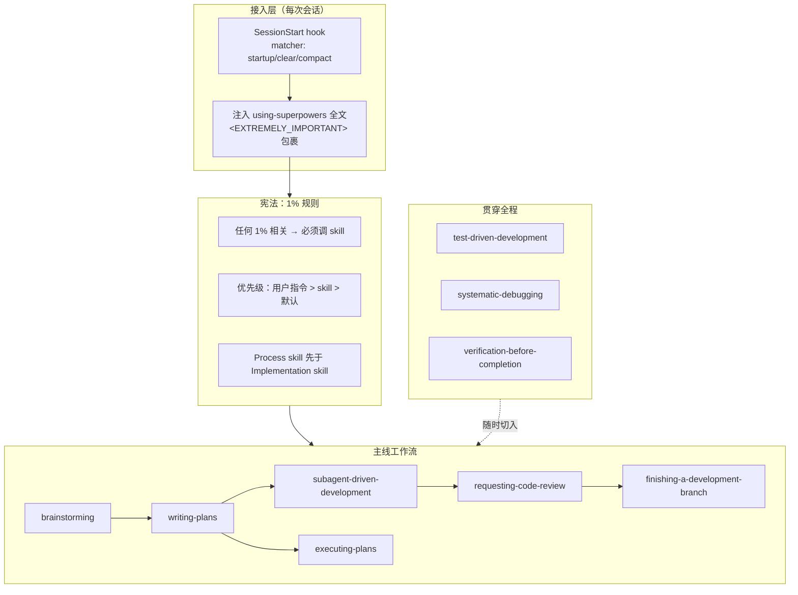

# superpowers：给 Claude Code 装上一整套开发方法论

> 技术分享文档 · 基于 superpowers **v6.0.3**（2026-06-18）
> 面向读者：已在使用 Claude Code 的同事

**一句话介绍**：superpowers 是一个 Claude Code 插件，它不给 Claude 加"工具"，而是给 Claude 加**一整套软件开发方法论**——由 14 个可组合的 skill（TDD、系统化调试、头脑风暴、计划、子 agent 驱动开发、代码评审、完工验证……）加一段"开机引导指令"组成。装上之后，你只要正常说"我们来做个 X"，Claude 会自己退一步先跟你对齐需求、写 spec、拆计划、红绿 TDD 实现、评审、验证、收尾——把"凭感觉一把梭"变成"有纪律、可复核的工程流程"。

**阅读指引**：正文只有两章——**第 1 章装起来，第 2 章用起来**，读完即可上手。想了解设计动机、skill 全景、机制原理、进阶话题的，按需翻附录 A–E。

---

## 1. 安装与接入

### 1.1 安装插件

superpowers 走 Claude Code 官方插件市场安装：

```
/plugin marketplace add anthropics/claude-plugins-official
/plugin install superpowers@claude-plugins-official
```

装完重启会话生效。（作者另有一个社区市场 `obra/superpowers-marketplace`，二选一即可。）

> superpowers 是**跨 harness** 的：仓库里同时带了 Codex、Cursor、Gemini CLI、Copilot CLI、Kimi、OpenCode、Pi、Antigravity 等 11 个平台的适配。本文以 Claude Code 为准，其他平台安装方式见其 README。

### 1.2 接入原理：每次开机注入一部"宪法"

superpowers 的接入不靠你记命令，而靠一个 **SessionStart hook**：每次会话启动 / `/clear` / 上下文压缩后，它都会把 `using-superpowers` 这个"元 skill"的**全文**塞进 Claude 的上下文，外面裹一层 `<EXTREMELY_IMPORTANT> You have superpowers …`。

这篇被注入的宪法只讲一件事——**如何发现和使用 skill**，核心是那条"1% 规则"（原理见附录 C.1）：

> "只要你觉得有哪怕 1% 的可能某个 skill 适用于你正在做的事，你就**绝对必须**调用它。这不是可选项，不能自我合理化绕过。"

所以 superpowers 的"自动触发"本质是：**每个会话从第一条消息起，Claude 就带着"该用 skill 就必须用"的判断准则**。你说人话，它自己对号入座去调对应 skill。

> ⚠️ 关键验收点：如果新会话开头没有加载这段 bootstrap，14 个 skill 就只是"躺在磁盘上、永不被调用"。所以升级插件后要**刷新 marketplace 再重启**——hook 有本地缓存。

### 1.3 验证接入成功

新开一个会话，直接说一句：

> "我们来做一个 React todo list。"

如果 Claude **没有**立刻写代码，而是先说"我先用 brainstorming skill 跟你对齐需求"并开始一次一个地问你澄清问题——说明 bootstrap 已生效、接入完成。反之如果它上来就甩代码，说明 SessionStart hook 没加载，回去检查安装。

### 1.4 什么项目适合 / 不适合用

诚实地说，这套方法论有"重量"，不是所有场景都划算：

- **适合**：跨天跨周的功能开发、需要可复核质量的正经项目、多任务可并行拆分的实现、你希望 Claude "自主干活几小时不跑偏"的场合。
- **可以退化着用**：单会话小任务——你仍可只借它的某一个 skill（比如只用 `systematic-debugging` 查个 bug），不必走完整链路。
- **不太合适**：一次性脚本、纯问答、你明确"别跟我啰嗦流程、直接改"的场合——这时 skill 的 HARD-GATE 反而是负担。记住**用户显式指令永远压过 skill**（附录 C.1），你说"跳过 TDD"它就跳过。

---

## 2. 如何使用

> 本章是分享的核心：怎么触发（§2.1）、一条主线怎么串（§2.2）、14 个 skill 分别管什么（§2.3）、哪些不容商量（§2.4）、别怎么用（§2.5）。

### 2.1 你几乎不用主动做什么：说人话，skill 自动触发

日常心智负担被刻意压到最低——**你不需要记 14 个 skill 的名字，也不需要手打斜杠命令**。因为 bootstrap 已注入，Claude 会自己判断该调哪个。你只在两种时候能"看见"这套机制：

**① 它会先宣告再动手。** 调用一个 skill 后，Claude 会说一句 `Using [skill] to [purpose]`，例如"I'm using the writing-plans skill to create the implementation plan"。看到这句，就知道它进了哪个流程。

**② 有清单的 skill 它会建 todo 逐项走。** 像 brainstorming（9 步）、writing-skills 这类带 checklist 的 skill，Claude 会为每一项建一个 todo，按序完成、当着你的面推进——流程对你透明可见。

你要做的只有：**正常描述任务**（"做个 X"、"这个 bug 怎么回事"、"帮我 merge"），以及在它抛给你的**决策点**上拍板（brainstorming 会一次一个问你、writing-plans 会让你二选执行方式、finishing 会给你 4 个集成选项）。

> 想手动点名也行：Claude Code 里直接调 `Skill` 工具选 `superpowers:brainstorming` 之类。但**永远不要自己去 cat SKILL.md**——手动读文件不等于激活 skill，必须走 skill 加载机制。

### 2.2 主线工作流：从一个想法到合并的一条链

superpowers 最大的价值不是单个 skill，而是它们**串成的一条链**。一个典型功能从零到合并，Claude 会顺着这条主线走：

```
brainstorming ──→ using-git-worktrees ──→ writing-plans ──→ 执行（二选一）──→ requesting-code-review ──→ finishing-a-development-branch
  探意图、               建隔离工作区、        拆成傻瓜也能         ├ subagent-driven-        每任务后 + 全           测试全过后给
  出 spec、              验证干净基线          执行的 bite-         │  development（推荐）      分支最终评审            merge / PR /
  设计获批前                                  sized 任务计划       └ executing-plans        （receiving-code-       keep / discard
  卡住实现                                                          （独立 session）          review 处理反馈）        四选项 + 清理
```

三个贯穿全程的"背景 skill"随时切入：

- **test-driven-development**：任何写实现代码的环节都先红后绿（每个 implementer 子 agent 都遵循）；
- **systematic-debugging**：任何 bug / 测试失败 / 意外行为出现时切入，先查根因再改；
- **verification-before-completion**：任何"我完成了 / 修好了 / 通过了"的宣称之前，必须先跑验证命令、读到真实输出才能说。

还有一条并行支线：遇到**多个相互独立、无共享状态**的任务（比如 3 个不同根因的测试文件同时挂了），走 **dispatching-parallel-agents**，一条回复里同时派多个 agent 并发处理。

这条链的设计哲学是：**先想清楚再动手、每一步都留下可复核的证据、把"该不该继续"的琐碎决策交给流程而不是反复问你**——所以它常能自主连续工作数小时不偏离计划（子 agent 驱动的原理见附录 C.3）。

### 2.3 14 个 skill 速查

按用途分五组。每个 skill 的 description 刻意**只写"何时用"、不写"做什么"**——这是它们能被 Claude 精准自动触发的关键（原理见附录 C.2）。

**入口 / 元**

| skill | 何时用 | 干什么 |
|---|---|---|
| **using-superpowers** | 每次对话开始（hook 自动注入） | 所有 skill 的"使用宪法"：1% 规则、指令优先级、rigid/flexible 分类、宣告惯例 |
| **writing-skills** | 造 / 改 / 验证 skill 时 | 把 TDD 用到"写流程文档"上——"没先看过 agent 在没 skill 时失败，就不算写对了 skill" |

**创作前（Process）**

| skill | 何时用 | 干什么 |
|---|---|---|
| **brainstorming** | 任何创作性工作之前 | 苏格拉底式对话打磨想法 → spec；**设计获批前 HARD-GATE 卡死一切实现**；终态只能转 writing-plans |

**计划三件套**

| skill | 何时用 | 干什么 |
|---|---|---|
| **writing-plans** | 有了 spec、动代码之前 | 拆成 2–5 分钟一步的 bite-sized 任务，文件路径 / 完整代码 / 测试 / 验证命令全写死，禁占位符 |
| **subagent-driven-development** | 在当前 session 执行、任务大体独立（**推荐主力**） | 每个任务派一个全新子 agent 干活 → 两阶段 review（规格 + 质量）→ 全分支最终 review |
| **executing-plans** | 在独立 session 执行、要人类检查点 | 加载计划 → 批判性复审 → 逐任务执行 → 完成汇报（有 subagent 的平台建议改用上一个） |

**代码评审两件套**

| skill | 何时用 | 干什么 |
|---|---|---|
| **requesting-code-review** | 完成任务 / 大功能后 / merge 前 | 派一个 reviewer 子 agent，在问题级联前抓住；按严重度处理（Critical 立即修） |
| **receiving-code-review** | 收到评审、实施建议之前 | 技术评估而非情绪表演——**禁止"你说得太对了""谢谢指出"**，先验证再实施 |

**验证 / 并行 / 隔离 / 收尾**

| skill | 何时用 | 干什么 |
|---|---|---|
| **verification-before-completion** | 任何"完成"宣称之前 | 铁律：没有当场的验证证据，不许说通过 |
| **dispatching-parallel-agents** | 2+ 个独立、无共享状态的任务 | 每个域派一个 agent，同一回复多派 = 并发 |
| **using-git-worktrees** | 开始需要隔离的功能开发前 | 先检测已有隔离 → 优先平台原生工具 → 再 git 兜底；"永远别跟 harness 对着干" |
| **finishing-a-development-branch** | 实现完成、测试全过 | 给恰好 4 个集成选项（merge / PR / keep / discard），discard 需输入确认，再清理 worktree |
| **systematic-debugging** | 任何 bug / 测试失败 / 意外行为 | 铁律：没查到根因不许改；四阶段（根因 → 模式 → 假设验证 → 实现）；修 3 次没好就质疑架构 |
| **test-driven-development** | 实现任何功能 / 修 bug 之前 | 铁律：没有失败测试不许写实现代码；先写了实现就删掉重来（"Delete means delete"） |

### 2.4 rigid vs flexible：哪些不容商量

`using-superpowers` 把 skill 分两类，**skill 自己会告诉你属于哪类**（看文中有没有 `Iron Law` / `<HARD-GATE>` / "Red Flags - STOP" / 合理化对照表这些信号）：

- **Rigid（铁律型，严格照做，不得为"效率"松绑）**：TDD、systematic-debugging、verification-before-completion、brainstorming、receiving-code-review、writing-skills、subagent-driven-development、using-git-worktrees、finishing-a-development-branch。这些都带铁律或硬门，是防止 Claude "合理化偷懒"的护栏。
- **Flexible（适配型，按上下文灵活运用原则）**：writing-plans（半 rigid，有强模板但按代码库适配）、executing-plans、requesting-code-review、dispatching-parallel-agents。

理解这个分类，你就知道**什么时候能让 Claude"通融一下"、什么时候不该**：让它跳过 flexible skill 的某步通常没事；但让它"这次先不写测试直接实现""还没查根因先试个修复"——那是在拆它最核心的护栏，多半会翻车。

### 2.5 最佳实践与反模式

**✅ 建议这么做**

- **说人话，别背命令**：正常描述任务即可，触发交给 bootstrap。你的活是在决策点拍板。
- **尊重 HARD-GATE**：brainstorming 卡住实现是特性不是 bug——"这太简单不需要设计"恰恰是它要防的念头。
- **执行主力选 subagent-driven-development**：有子 agent 的平台上它比 inline 执行明显更快更省 token（作者 eval 数据见附录 D）。
- **让评审早发生、常发生**：requesting-code-review 的信条是"review early, review often"，别攒到最后。
- **收到评审先验证再改**：reviewer 也会错，用技术理由反驳是对的；但"验证前就道谢照做"是伪协作。

**❌ 别这么做**

- **让它跳过 rigid skill 的纪律**："这次先不 TDD""先改了再说根因"——这是拆护栏，翻车成本远高于省下的那点时间。
- **自己 cat SKILL.md**：手动读文件不激活 skill，等于没用。
- **宣称完成却没跑验证**："应该 / 大概 / 看起来通过了"都是危险信号——verification-before-completion 的铁律就是治这个。
- **在 main/master 上未经同意直接实现**：多个 rigid skill 都把这列为红线，先隔离再动手。
- **并行派多个"实现"子 agent 改同一片代码**：会冲突。并行只用于相互独立的域。

---

# 附录

> 以下内容不影响上手使用，按需阅读：
> **A** 为什么需要（设计动机与哲学）· **B** 全景图（架构与 skill 关系）· **C** 核心机制拆解（原理）· **D** 进阶话题 · **E** Q&A 与资源

## 附录 A：为什么需要 superpowers（设计动机与哲学）

### A.1 它想解决什么

裸的 coding agent 有几个反复出现的老毛病：**一上来就写代码**（没对齐需求就动手）、**跳过测试**（"我看着对就行"）、**不查根因瞎修**（试一个改动看看好没好）、**没验证就宣称完成**（"应该没问题"）。这些不是能力问题，是**纪律**问题——模型知道该 TDD、该查根因，但在任务流里会"合理化"绕过。

superpowers 的定位（README 原文）：

> "Superpowers is a complete software development methodology for your coding agents, built on top of a set of composable skills and some initial instructions that make sure your agent uses them."

它不是加工具，是**加纪律**——用一组 skill 把"正确的工程流程"固化成 agent 每次都必须走的强制工作流。

### A.2 四条哲学（README "Philosophy"）

1. **Test-Driven Development**——永远先写测试；
2. **Systematic over ad-hoc**——流程优于瞎猜；
3. **Complexity reduction**——简单性是首要目标（YAGNI / DRY）；
4. **Evidence over claims**——宣称成功前先拿证据。

配一句总纲：**"Mandatory workflows, not suggestions"**（强制工作流，不是建议）。

### A.3 一个刻意的用词

superpowers 通篇坚持用 **"your human partner"（你的人类搭档）**而不是 "the user"，CLAUDE.md 明说这是 "deliberate, not interchangeable"。这不是文字游戏——它定义了协作关系：Claude 是带着判断力的搭档，评审要给技术理由、反驳要有依据、不确定就停下来问，而不是一个唯命是从、也不会验证的执行器。

## 附录 B：全景图——架构与 skill 关系

### B.1 接入机制一图流



读这张图记住三件事：

1. **接入靠 hook 不靠记忆**——每次开机把宪法塞进上下文，agent 从第一条消息就"带着规矩"。
2. **skill 是链不是点**——单个 skill 有用，但价值在它们串成的"想 → 划 → 做 → 审 → 验 → 收"闭环。
3. **纪律靠护栏不靠自觉**——rigid skill 的铁律 / HARD-GATE 就是防"合理化偷懒"的物理护栏。

### B.2 skill 之间的显式引用

各 SKILL.md 用 `REQUIRED SUB-SKILL:` 标记显式衔接（**绝不用 `@` 链接**——那会 force-load 烧掉 200k+ 上下文，见附录 C.2）：

- writing-plans 的计划头强制标注下一步是 subagent-driven-development（推荐）或 executing-plans；
- subagent-driven-development 依赖 using-git-worktrees、writing-plans、requesting-code-review、finishing-a-development-branch，子 agent 遵循 test-driven-development；
- systematic-debugging 的 Phase 4 用 test-driven-development 写失败测试，收尾用 verification-before-completion；
- writing-skills 把 test-driven-development 列为必备背景。

## 附录 C：核心机制拆解（懂原理才敢信任）

### C.1 "1% 规则"与指令优先级

**规则**：只要有 1% 可能某 skill 适用，就必须调用它——哪怕在澄清提问之前。这条被 `<EXTREMELY-IMPORTANT>` 包裹，措辞是"not negotiable, not optional"。

**为什么这么极端**：模型对"要不要用 skill"天然倾向于省事跳过，配了一张"合理化对照表"专治各种借口——"这只是个简单问题"→"问题也是任务，先查 skill"；"让我先探一下代码库"→"skill 会告诉你**怎么**探，先查"。用极端措辞 + 合理化清单，把"跳过"这条路堵死。

**但用户永远优先**：指令优先级是 ① 用户显式指令（CLAUDE.md / 直接请求）> ② superpowers skill > ③ 默认系统提示。CLAUDE.md 说"别用 TDD"而 skill 说"永远 TDD"——听用户的。skill 覆盖的是"默认行为"，不是"你的指令"。

### C.2 SDO：description 只写"何时用"

每个 SKILL.md 的 frontmatter 只有 `name` + `description`，而 description **刻意只写"Use when …"，绝不总结工作流**。这叫 **SDO（Skill Discovery Optimization）**，来自一个真实的测试教训：

> 当 description 里总结了流程，agent 会"照着 description 走"而不去读 skill 正文——比如 description 写了"code review between tasks"，agent 就只做了一次 review 而不是正文要求的两次。

所以 description 的唯一职责是**给 agent 判断"现在要不要读这个 skill"**，真正的 how 全在正文，读了才照做。这也是为什么交叉引用用 `REQUIRED SUB-SKILL:` 文本标记而非 `@` 硬链接——避免把一堆 skill 正文提前 force-load 进上下文。

### C.3 子 agent 驱动开发：为什么快又省

subagent-driven-development 是信息量最大的 skill，核心公式：

> **每个任务一个全新子 agent + 任务级 review（规格 + 质量）+ 全分支最终 review = 高质量 + 快迭代。**

关键设计：

- **上下文隔离**：每个 implementer 子 agent 拿到的是你精心构造的、它这个任务需要的上下文，**绝不继承你的 session 历史**——你的主上下文只用来协调，不被实现细节撑爆。
- **持续执行不问废话**：任务之间不停下来问"要继续吗"——只有 BLOCKED / 真歧义 / 全部完成才停。这是它能自主跑几小时的原因。
- **一切走文件不粘贴**：任务简报、report、评审包都走文件（`scripts/task-brief`、`scripts/review-package`），不塞进 prompt——省上下文的关键。评审包的 BASE 用派活前记录的 commit，**绝不用 `HEAD~1`**（会丢多 commit）。
- **进度落 ledger**：进度写 `.superpowers/sdd/progress.md`，压缩后靠它 + `git log` 恢复，**别重派已完成任务**——作者称这是"观测到的最贵的失败"。
- **模型分档**：用"能干活的最弱模型"——机械转录用最便宜档，集成判断用标准档，架构 / 最终评审用最强档，且**永远显式指定模型**（否则继承 session 的贵模型）。

### C.4 评审的红线：不许预判、不许表演

**请求评审侧**（requesting-code-review）：构造 reviewer 的 prompt 时**不得预先压低 finding 的严重度、不得写"别 flag 这个"、不得让 reviewer 重跑 implementer 已跑的测试**——否则评审就成了走过场。

**接收评审侧**（receiving-code-review）：这是最反直觉的一条——**禁止一切"表演式同意"**。不许说"你说得太对了""好棒的发现""我这就改"（在验证之前），甚至**禁止任何形式的道谢**："Thanks for catching that!" 也要删掉，因为"Actions speak. Just fix it."。响应模式是 READ → UNDERSTAND → VERIFY → EVALUATE → RESPOND → IMPLEMENT：外部反馈是**待评估的建议，不是待执行的命令**，先验证、再质疑、然后才实施。

### C.5 verification 的铁律

**规则（Iron Law）**："NO COMPLETION CLAIMS WITHOUT FRESH VERIFICATION EVIDENCE"——本条消息里没跑过验证命令，就不能说它通过。

**门函数**：IDENTIFY 该跑什么命令 → RUN 完整命令 → READ 全部输出 / 退出码 / 失败数 → VERIFY → 才允许 claim。危险信号：`should / probably / seems to`、验证前就说"Great! / Perfect! / Done!"、**信任子 agent 的成功汇报**（要独立核对 VCS diff）、"就这一次不验了"、累了想收工。

这条是整套方法论"Evidence over claims"哲学的落地闸门——没有它，前面所有流程产出的"完成"都不可信。

## 附录 D：进阶话题

### D.1 跨 harness 与 vendor-neutral 设计

superpowers 一套 skill 要在 11 个平台跑，靠的是**"skill 正文只说动作，不说工具名"**：正文写"dispatch a subagent""create a todo"，具体映射到哪个平台的哪个工具，由 `using-superpowers/references/` 下的 6 份平台工具映射表（`claude-code-tools.md` / `codex-tools.md` / `gemini-tools.md` …）负责。hook 也做了跨平台处理：不同平台输出不同 JSON 字段（Cursor 用 `additional_context`、Claude Code 用 `hookSpecificOutput.additionalContext`），用 `printf` 而非 heredoc 规避 bash 5.3+ 的 hang。

### D.2 6.0.x 的变化与性能声明

作者在 RELEASE-NOTES 里给出的 6.0.0 数据：把 subagent-driven-development 每任务的两个 reviewer prompt 合并成一个、废弃全局 worktree 目录改用项目内 `.worktrees/`、新增 Kimi/Pi/Antigravity 支持——号称在 eval 里达到"**约 2 倍速度、少约 50% token**"。6.0.3 把子 agent 的 scratch 文件从 `.git/` 移到 `.superpowers/sdd/`（Claude Code 保护 `.git/` 导致子 agent 写 report 被拒）。这些数字是作者自测口径，供参考。

### D.3 造自己的 skill：把 TDD 用到流程文档上

writing-skills 的核心主张很硬核：**"没先看过 agent 在没有这个 skill 时怎么失败，你就不知道这个 skill 教得对不对。"** 对应铁律 "NO SKILL WITHOUT A FAILING TEST FIRST"——新建和**编辑** skill 都适用。TDD 映射到写 skill：test case = 用子 agent 跑的压力场景；production code = SKILL.md；RED = agent 没 skill 时违规（baseline）；GREEN = 有 skill 后合规；REFACTOR = 堵剩下的漏洞。它还配了一份 `persuasion-principles.md`（借 Cialdini 说服原理让 skill 更"劝得动"模型）。

如果你想给本项目沉淀自定义 skill，这个 skill 是标准入口——但注意它要求"先证明失败"，别跳过。

### D.4 遥测与关闭

brainstorming 的可视化伴侣默认会上报"版本 + 使用量"（不含项目 / prompt 内容）。介意的话用 `SUPERPOWERS_DISABLE_TELEMETRY=1` 关闭，它也尊重通用的 `DISABLE_TELEMETRY` / `CLAUDE_CODE_DISABLE_NONESSENTIAL_TRAFFIC`。

## 附录 E：Q&A 与资源索引

**Q：装了它，是不是每件小事都要走一遍重流程？**
A：不会。skill 靠"1% 相关"判断触发，纯问答 / 一次性小改它不会硬拉你走 brainstorming。而且**用户指令永远优先**——你说"直接改别啰嗦"，它就跳过流程。重流程只在"创作性工作"（建功能 / 改行为）时启动。

**Q：会拖慢速度、烧很多 token 吗？**
A：主线看似步骤多，但 subagent-driven-development 用上下文隔离 + 文件交接 + 模型分档来控成本，作者 eval 口径反而是"约 2 倍速度、少约 50% token"（附录 D.2）。直觉上"多了评审和测试"，实际省下的是"没测试导致的返工"和"没查根因的反复瞎修"。

**Q：它和项目自己的 CLAUDE.md 规则冲突怎么办？**
A：指令优先级写死了——**用户 / 项目显式指令 > skill > 默认**。CLAUDE.md 说的算，skill 覆盖的只是模型的默认行为。

**Q：我只想用其中一个 skill（比如只用调试）行吗？**
A：行。skill 可独立调用——遇到 bug 时它会自动触发 systematic-debugging，你不必走完整链路。链是"默认最佳路径"，不是"绑死的唯一路径"。

### 资源

- 插件仓库：https://github.com/obra/superpowers （作者 Jesse Vincent / Prime Radiant，MIT）
- 官方市场安装：`/plugin install superpowers@claude-plugins-official`
- 元 skill（宪法）：`skills/using-superpowers/SKILL.md`（会被 SessionStart 全文注入）
- 各 skill 源码：`skills/<name>/SKILL.md` + 附带的 prompt 模板 / 技术手册（如 systematic-debugging 的 `root-cause-tracing.md`、subagent-driven-development 的 `implementer-prompt.md`）
- 版本变更：仓库 `RELEASE-NOTES.md`

---

*文档基于 superpowers v6.0.3 源码编写，用于团队技术分享。*
