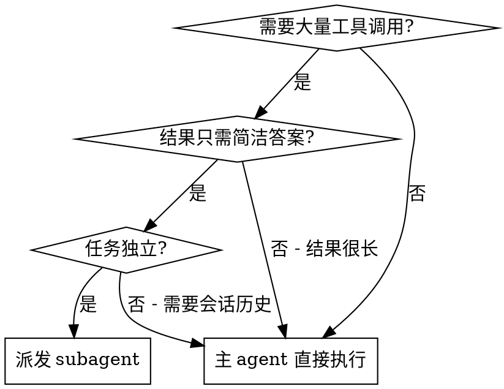

# KDev Explorer

## Overview

派发一个独立 subagent 执行任务，主会话保持轻量。Subagent 完成后返回简洁结论。

**核心原则：上下文隔离**
- 主 agent 不被大量工具调用结果膨胀
- Subagent 的探索过程不污染主会话历史
- 只返回你需要的答案，不返回过程

**为什么简洁至关重要**

Subagent 的输出会直接进入主会话上下文。如果输出过长（如 100+ 行），主会话会被无用信息膨胀，导致：
- 后续对话 token 消耗增加
- 关键信息淹没在冗余内容中
- 用户需要花时间过滤

**目标输出长度：**
- 文档探索：≤ 50 行（目录结构 + 每文档 1 句）
- 网页抓取：≤ 30 行（要点列表 + 合成结论）
- 代码搜索：≤ 40 行（文件列表 + 关键发现）

## When to Use



**适用：**
- 网页抓取 + 总结（多个 WebFetch/MCP fetch）
- 文档目录探索（Glob + 多个 Read）
- 代码库查找（多次 Grep/Glob）
- 数据查询（多次 API 调用）

**不适用：**
- 需要实时交互反馈
- 任务依赖主会话历史
- 结果本身很长（大段代码）

## The Pattern

### 1. 判断是否适合派发

检查三个条件：
- 是否会产生大量工具调用？
- 结果是否可以简洁表达？
- 任务是否独立（不需要会话历史）？

### 2. 构造 Prompt

使用四要素结构：

```markdown
**Scope:** {明确的范围}

**Task:**
1. {具体步骤}
2. {具体步骤}

**Do NOT:**
- {约束}

**Return:**
- {输出格式要求}
```

### 3. 选择 Subagent 类型

| 任务类型 | subagent_type |
|----------|--------------|
| 代码/文档探索 | `Explore` |
| 网页抓取/研究 | `general-purpose` |

### 4. 派发并等待

调用 Agent 工具，等待返回。**不要在等待期间执行其他操作**。

### 5. 展示结果

收到结果后，简洁展示给用户。

## Prompt Templates

### 探索文档目录

```markdown
Explore documentation directory:

**Scope:** {directory_path}

**Task:**
1. List all files using Glob `{pattern}`
2. Read key documents (prioritize: {document_types})
3. Summarize each document's core theme (1 sentence each)

**Do NOT:**
- Read every file
- Include implementation details
- Output more than 50 lines

**Return:**
- File tree structure (brief, no full paths)
- Document themes: filename + 1 sentence
- Overall purpose (1 sentence)
- Target length: ≤ 50 lines
```

### 网页抓取

```markdown
Fetch and summarize web content:

**Scope:** {url_list}

**Task:**
1. Fetch each URL
2. Extract key information: {what}
3. Synthesize into bullet points

**Do NOT:**
- Return raw HTML
- Follow links beyond specified URLs
- Output more than 30 lines
- Include all details - only key findings

**Return:**
- 5-10 key findings (bullet points)
- 1-2 sentence synthesis
- Target length: ≤ 30 lines
```

### 代码探索

```markdown
Explore codebase for {target}:

**Scope:** {repository_path}

**Task:**
1. Search using Grep for: {pattern}
2. Locate files using Glob: {glob_pattern}
3. Read 3-5 key files to understand {what}

**Do NOT:**
- Read all matched files
- Refactor or modify code
- Output more than 40 lines
- Include full code snippets

**Return:**
- Files list (paths only)
- Key findings: 3-5 bullet points
- Target length: ≤ 40 lines
```

## Common Mistakes

| 错误 | 正确 |
|------|------|
| "去看看" | "探索 {path} 的 {target}" |
| 没有约束 | 添加 Do NOT + 行数限制 |
| 没有输出格式 | 规定 Return 格式 + 目标长度 |
| 主 agent 继续工作 | 等待 subagent 返回 |
| 输出过长（100+行） | 强制 ≤ 50 行 |
| 包含完整内容摘要 | 只返回 1 句核心主题 |

## Example

用户说："帮我总结下 docs/skills/kdev-code-graph 目录的内容"

判断：
- 会产生大量工具调用（Glob + 多个 Read）✓
- 结果可以简洁表达（目录结构 + 文档主题）✓
- 任务独立（不需要会话历史）✓

派发：

```
Agent(
  subagent_type: "Explore",
  prompt: "Explore documentation directory:

**Scope:** D:\Works\SecDev\kdev-agents\docs\skills\kdev-code-graph

**Task:**
1. List all markdown files using Glob `**/*.md`
2. Read key documents (PRD, architecture, analysis)
3. Summarize each document's core theme (1 sentence each)

**Do NOT:**
- Read every file exhaustively
- Include implementation code details
- Output more than 50 lines

**Return:**
- File tree structure (brief)
- Document themes: filename + 1 sentence
- Overall purpose (1 sentence)
- Target length: ≤ 50 lines"
)
```

等待返回，展示结果。

## Extension Points

kdev-explorer 可与 kdev-code-graph 插件联动，提供语义级别的代码探索。

### 联动判断

当用户请求涉及以下关键词时，考虑调用 kdev-code-graph skills：

| 用户请求类型 | 推荐联动 Skill | 判断关键词 |
|--------------|----------------|------------|
| 需求追溯 | `semantic-trace` | "需求实现了吗"、"找对应代码"、"文档到代码" |
| 变更影响 | `code-review-enhanced` | "改动会影响什么"、"爆炸半径"、"调用链" |
| 文档同步 | `doc-code-sync` | "文档是否更新"、"文档和代码对不上" |

### 联动方式

**当前状态（MCP server 未实现）：**
- 在 prompt 返回结果中**建议用户调用相关 skill**
- 示例：`"如果需要语义级别的追溯，可以调用 /semantic-trace"`

**未来状态（MCP server 实现后）：**
- 直接在 subagent prompt 中调用 MCP tools
- 示例：
```markdown
**Task:**
1. 先用 Grep 搜索关键词定位候选文件
2. 调用 mcp__semantic-graph__semantic_query 获取语义关联
3. 综合返回：关键词匹配 + 语义关联结果
```

### 代码探索模板增强版

```markdown
Explore codebase for semantic relations:

**Scope:** {repository_path}

**Task:**
1. Search using Grep for: {pattern}
2. If semantic analysis needed, note: "建议调用 /semantic-trace 获取更深入的语义追溯"
3. Read key files to understand {what}

**Do NOT:**
- Read all matched files
- Refactor or modify code
- Call MCP tools if not available

**Return:**
- Keywords match: {files list}
- Semantic extension: {"建议调用 semantic-trace" or "已获取语义关联"}
```